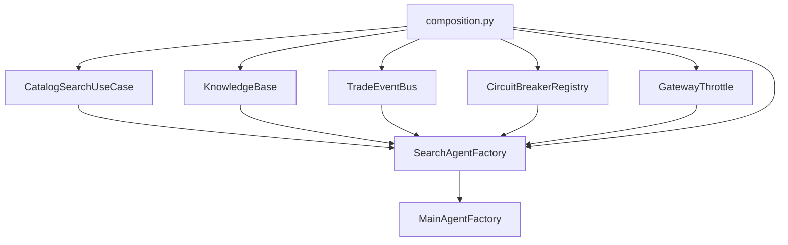
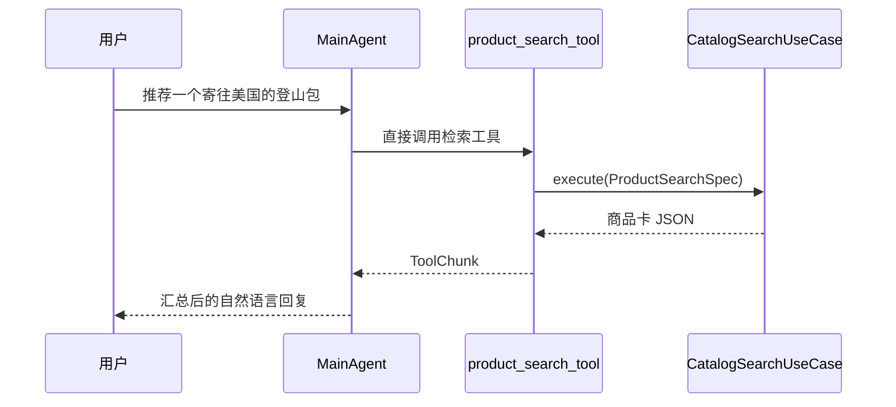
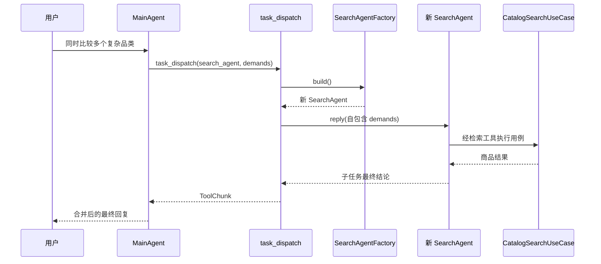

# SearchAgentFactory 模式详解

> 适用范围：Globex 项目 `app/application/agents/` 中的 Agent 创建与工具复用机制。  
> 核心文件：`search_agent.py`、`main_agent.py`、`task_dispatch_tool.py`、`composition.py`。  
> 本文描述当前代码的真实行为，不把 `SearchAgentFactory` 误解为 SearchAgent 本身。

## 1. 核心结论

本项目中的 `SearchAgentFactory` 是一个有状态依赖、无对话状态的“检索 Agent 装配器”。它同时承担三个职责：

1. 保存创建检索能力所需的共享依赖；
2. 通过 `build_tools()` 创建一组可复用的检索工具包装对象；
3. 通过 `build()` 创建一个新的、上下文隔离的 SearchAgent。

可以用下面的等式概括：

```text
SearchAgentFactory
  = 检索依赖持有者
  + 检索工具装配器
  + 临时 SearchAgent 创建器
```

它不负责执行商品搜索，不保存买家的对话历史，也不是一个常驻的 SearchAgent。

## 2. 为什么需要 Factory

创建一个可工作的 SearchAgent 并不只是调用一次 `Agent()`。创建过程需要统一装配：

- SearchAgent 的名称和系统提示词；
- OpenAI 兼容模型及流式参数；
- 全局共享的模型并发闸门；
- 商品检索工具；
- 品类知识库工具；
- 可选的联网搜索工具；
- 工具超时与熔断中间件；
- Agent 级追踪和 Token 预算中间件；
- 上下文压缩策略；
- ReAct 最大迭代次数。

如果 MainAgent、子 Agent 调度器或测试代码分别手工创建 SearchAgent，很容易出现配置漂移，例如：

- 一条路径忘记注册 `category_insight_tool`；
- 一条路径绕过全局 `GatewayThrottle`；
- 配置了 Tavily，但部分 Agent 没有 `web_search_tool`；
- 不同创建点使用不同的熔断器或上下文策略；
- 多个任务错误复用同一个 AgentState。

Factory 将这些规则收敛到一个位置，调用方只需要表达两种意图：

```python
tools = search_factory.build_tools()  # 我只需要检索工具
agent = search_factory.build()        # 我需要一个完整且全新的检索 Agent
```

## 3. Factory 在系统中的装配位置

`main_agent.py` 虽然导入了 `SearchAgentFactory`，但不会自行创建它。真正的对象实例化发生在 Composition Root：

```python
# app/composition.py
search_factory = SearchAgentFactory(
    settings,
    catalog_search,
    bus,
    knowledge_base,
    circuit_registry,
    throttle,
)

main_factory = MainAgentFactory(
    settings,
    search_factory,
    trade_factory,
    bus,
    preference_store,
    circuit_registry,
    throttle,
    ...,
)
```

因此依赖关系是：



这里使用的是构造器依赖注入：`MainAgentFactory` 不负责寻找或创建检索依赖，而是接收一份已经装配好的 `SearchAgentFactory`。

## 4. SearchAgentFactory 保存的依赖

`SearchAgentFactory.__init__()` 接收六个对象：

| 依赖 | 类型 | 职责 | 生命周期特征 |
|---|---|---|---|
| `_settings` | `Settings` | 模型、上下文、Tavily 等配置 | 容器级共享 |
| `_catalog_search` | `CatalogSearchUseCase` | 执行商品召回、过滤、精排和商品卡组装 | 进程内共享 |
| `_bus` | `TradeEventBus` | 发布工具调用和结果事件 | 进程内共享 |
| `_knowledge_base` | `KnowledgeBase` | 查询品类洞察 RAG | 进程内共享 |
| `_circuit_registry` | `CircuitBreakerRegistry` 或共享实现 | 记录各工具的熔断状态 | 进程内或 Redis 共享 |
| `_throttle` | `GatewayThrottle` | 统一控制全部 Agent 的模型请求并发与间隔 | 进程内共享 |

Factory 保存的是“创建 Agent 所需的稳定依赖”，不是“某次对话产生的可变状态”。

下面这些内容不保存在 Factory 中：

- 买家的聊天上下文；
- AgentState；
- 当前 ReAct 迭代进度；
- 某个子任务的工具调用历史；
- 某次派发的 `demands`；
- 最终检索结果。

## 5. `build_tools()`：只装配工具，不创建 Agent

`build_tools()` 的职责是返回 SearchAgent 的业务工具集合：

```python
def build_tools(self) -> list[FunctionTool]:
    tools = [
        FunctionTool(
            build_product_search_tool(self._catalog_search, self._bus),
            is_read_only=True,
            middlewares=self._resilience(),
        ),
        FunctionTool(
            build_category_insight_tool(self._knowledge_base, self._bus),
            is_read_only=True,
            middlewares=self._resilience(),
        ),
    ]

    if self._settings.tavily_api_key:
        tools.append(...web_search_tool...)

    return tools
```

### 5.1 工具构造的两层 Factory

这里实际上有两层创建逻辑：

```text
build_product_search_tool(usecase, bus)
  → 返回绑定了依赖的 Python 异步函数
  → FunctionTool(...) 再将函数包装成 AgentScope 工具
```

例如：

```python
build_product_search_tool(self._catalog_search, self._bus)
```

返回的工具函数已经闭包绑定：

- `CatalogSearchUseCase`；
- `TradeEventBus`。

模型只能看到工具名称、参数 schema 和返回结果，不需要知道底层依赖从哪里来。

### 5.2 每次调用都会创建新的包装对象

`build_tools()` 没有缓存结果。每次调用都会创建新的：

- Python 工具闭包；
- `FunctionTool`；
- `ToolResilienceMiddleware`。

但这些新对象引用的底层依赖仍然是 Factory 中保存的共享对象：

```text
新的 FunctionTool ─┐
新的 FunctionTool ─┼──> 同一个 CatalogSearchUseCase
新的 FunctionTool ─┼──> 同一个 TradeEventBus
                    └──> 同一个 CircuitBreakerRegistry
```

### 5.3 可选工具由 Factory 统一裁剪

联网搜索工具的注册由运行配置决定：

```python
if self._settings.tavily_api_key:
    tools.append(web_search_tool)
```

没有 Tavily 密钥时，模型的工具 schema 中根本不存在 `web_search_tool`。这比注册一个必然报错的工具更明确。

## 6. `build()`：创建完整且全新的 SearchAgent

`build()` 将提示词、模型、工具和策略组装为 AgentScope `Agent`：

```python
def build(self) -> Agent:
    prompts = load_prompts()["sub_agents"]["search"]

    return Agent(
        name=prompts["name"],
        system_prompt=prompts["system_prompt"],
        model=create_chat_model(...),
        toolkit=Toolkit(tools=list(self.build_tools())),
        middlewares=build_agent_middlewares(self._settings),
        context_config=build_context_config(...),
        react_config=ReActConfig(max_iters=6),
    )
```

每次执行 `build()` 都会得到：

- 一个新的 `Agent`；
- 一个新的 AgentState；
- 一个新的上下文空间；
- 一个新的模型包装实例；
- 一个新的 Toolkit；
- 一套新的 FunctionTool 包装对象。

与此同时，创建出来的 Agent 仍然共享：

- 同一个商品检索 UseCase；
- 同一个商品 Repository；
- 同一个知识库；
- 同一个事件总线；
- 同一个模型限流器；
- 同一个熔断状态注册表。

这形成了“状态隔离、基础设施共享”的生命周期设计。

## 7. MainAgent 使用 Factory 的两条路径

MainAgent 对 `SearchAgentFactory` 有两种不同用法。

### 7.1 路径 A：复用工具，MainAgent 直接执行

`MainAgentFactory.build()` 将检索工具直接放进 MainAgent 的 Toolkit：

```python
tools = [
    *self._search_factory.build_tools(),
    *self._trade_factory.build_tools(),
    ...,
]
```

简单任务的实际调用链是：



这条路径没有创建 SearchAgent。`SearchAgentFactory` 只是向 MainAgent 提供了同款检索工具。

### 7.2 路径 B：创建子 Agent，隔离复杂任务

MainAgent 还持有 `task_dispatch` 工具。创建该工具时，`SearchAgentFactory` 被继续传入：

```python
build_task_dispatch_tool(
    self._search_factory,
    self._trade_factory,
    ...,
)
```

当 MainAgent 派发检索子任务时：

```python
if subagent_type == "search_agent":
    worker = search_factory.build()
```

调用链变为：



这条路径会增加一次独立 Agent 的“思考 → 工具调用 → 再思考”循环，适合：

- 多个可并行的独立子任务；
- 中间候选很多、需要隔离上下文的任务；
- 需要多次改写 query 和调用工具的深链任务。

## 8. 为什么主 Agent 和子 Agent 要共用工具来源

两条路径最终都从 `SearchAgentFactory.build_tools()` 获取工具，因此共享同一套业务实现：

```text
MainAgent 直接检索 ──────┐
                         ├──> product_search_tool
SearchAgent 子任务检索 ──┘        │
                                  v
                         CatalogSearchUseCase
```

这样可以避免两个常见问题。

### 8.1 避免业务逻辑分叉

如果 MainAgent 和 SearchAgent 各自实现检索工具，可能出现：

- 一边支持到手价，另一边不支持；
- 一边有价格硬过滤，另一边让模型自行过滤；
- 一边发布商品卡事件，另一边前端收不到商品卡；
- 一边接入新 reranker，另一边仍使用旧逻辑。

现在检索规则最终都收敛到同一个 `CatalogSearchUseCase`。

### 8.2 保留单干优先策略

MainAgent 已经拥有业务工具，不需要为一次简单查询额外创建子 Agent。这样可以减少：

- 一轮子 Agent 模型调用；
- 上下文传递；
- 延迟；
- Token 消耗；
- 调度失败点。

## 9. 为什么子 Agent 每次都重新创建

SearchAgent 的对话上下文存放在 AgentState 中。如果多个子任务复用同一个 SearchAgent：

```text
任务 A：找露营灯
任务 B：找咖啡机
```

任务 B 可能读到任务 A 的：

- 原始要求；
- 商品候选；
- 工具返回；
- 中间结论；
- 尚未完成的 ReAct 状态。

并发派发时，两个协程还可能同时修改同一个 AgentState。

当前实现通过每次调用 `search_factory.build()` 创建新 Agent，获得天然的上下文隔离：

```text
task_dispatch A → SearchAgent A → AgentState A
task_dispatch B → SearchAgent B → AgentState B
```

两个 Agent 可以共享底层只读检索能力，但不共享对话上下文。

## 10. MainAgent 与 SearchAgent 的生命周期差异

| 对象 | 创建方式 | 是否复用 | 是否持久化状态 |
|---|---|---|---|
| `SearchAgentFactory` | `composition.py` 创建 | 容器/进程内复用 | 不需要 |
| MainAgent | `MainAgentFactory.build()` | 按 `shopping_session_id` 复用 | 每轮保存 AgentState |
| SearchAgent | `SearchAgentFactory.build()` | 每次派发重新创建 | 不持久化 |
| 检索工具包装 | `build_tools()` 创建 | 随所属 Agent 存活 | 不持久化 |
| `CatalogSearchUseCase` | `composition.py` 创建 | 进程内共享 | 自身基本无会话状态 |

MainAgent 是会话级有状态对象；SearchAgent 是任务级临时对象；Factory 是容器级装配对象。

## 11. 共享限流与熔断为何由外部注入

`GatewayThrottle` 和 `CircuitBreakerRegistry` 没有在 Factory 内部自行创建，而是从 `composition.py` 注入。

### 11.1 GatewayThrottle

MainAgent、SearchAgent 和 TradeAgent 必须共享同一个模型闸门：

```text
MainAgent 模型调用 ────┐
SearchAgent 模型调用 ──┼──> 同一个 GatewayThrottle
TradeAgent 模型调用 ───┘
```

如果每个 Factory 创建自己的闸门，配置 `LLM_MAX_CONCURRENCY=2` 就可能变成三个 Agent 各允许 2 个，总并发实际达到 6。

### 11.2 CircuitBreakerRegistry

不同 Agent 调用同一个工具时应看到一致的故障状态。例如商品检索服务连续失败后：

- MainAgent 直接调用不应继续撞故障服务；
- 新建的 SearchAgent 也应看到该工具已经熔断。

因此新的工具中间件对象共享同一个熔断注册表。

## 12. 偏好注入和 Factory 的边界

`SearchAgentFactory.build()` 本身不知道当前买家是谁，也不会读取长期偏好。

偏好注入发生在 `task_dispatch_tool.py`：

1. 从 `ShoppingContext` 读取当前 `buyer_id`；
2. 从 `PreferenceStore` 查询偏好；
3. 根据本次 `demands` 选择相关偏好；
4. 创建 SearchAgent；
5. 把 `<buyer-preferences>` 作为额外消息送给 SearchAgent。

职责边界如下：

```text
SearchAgentFactory：如何创建 SearchAgent
task_dispatch：为哪个买家、带什么任务消息调用 SearchAgent
```

这使 Factory 保持与具体请求无关，可以被不同会话并发复用。

## 13. 这属于哪一种设计模式

从经典设计模式角度看，它不是严格教科书式的“抽象工厂”：

- 没有 `AbstractSearchAgentFactory` 接口；
- 没有多个互换的 Factory 子类；
- 没有创建多个产品族的抽象层。

它更接近以下几种实践的组合：

| 模式 / 实践 | 在本项目中的体现 |
|---|---|
| Simple Factory | `build()` 封装 SearchAgent 的创建细节 |
| Builder / Assembler | 将模型、Toolkit、中间件、上下文策略组装为 Agent |
| Dependency Injection | 依赖从 `composition.py` 构造并注入 Factory |
| Provider | MainAgent 和 task_dispatch 按需向 Factory 获取工具或 Agent |
| SubAgent as Tool | `task_dispatch` 将临时 SearchAgent 包装成 MainAgent 的工具能力 |

所以这里的 `Factory` 是工程语义上的命名：集中并统一对象创建，而不是为了严格匹配某一种 GoF UML 结构。

## 14. 代码修改时的注意事项

### 14.1 新增检索工具

如果工具应该同时供 MainAgent 和 SearchAgent 使用，应加入：

```text
SearchAgentFactory.build_tools()
```

不要分别在 `main_agent.py` 和 `search_agent.py` 注册，否则会产生两套工具清单。

### 14.2 新增只属于 SearchAgent 的工具

当前 `build_tools()` 会被 MainAgent 和 SearchAgent 同时使用。如果某个工具只能给 SearchAgent，不能直接无条件加入现有列表。可以将接口拆成：

```python
def build_shared_tools(): ...
def build_subagent_only_tools(): ...

def build():
    tools = [*build_shared_tools(), *build_subagent_only_tools()]
```

否则 MainAgent 也会获得该工具。

### 14.3 不要把请求状态写进 Factory 字段

下面这种做法会在并发请求之间串数据：

```python
self._current_buyer_id = buyer_id
self._current_query = query
```

Factory 是进程级共享对象。请求相关状态应该放在：

- 函数参数；
- `ShoppingContext`；
- 新创建的 AgentState；
- 局部变量。

### 14.4 谨慎缓存 Agent

不要为了减少创建成本，在 Factory 中加入：

```python
self._agent = self.build()
```

这会破坏子任务上下文隔离。若未来确实需要 Agent 池，必须先设计：

- AgentState 清理；
- 并发独占；
- 工具调用状态复位；
- 异常任务后的对象回收；
- 跨买家数据隔离。

### 14.5 共享资源要在 Composition Root 创建

以下对象应继续由 `composition.py` 创建并注入：

- 全局模型闸门；
- 熔断注册表；
- Repository；
- KnowledgeBase；
- EventBus；
- 外部客户端。

不要在每次 `build()` 时重新创建连接池、Qdrant 客户端或全局限流器。

## 15. 推荐的测试关注点

修改 Factory 后至少应覆盖以下行为：

1. `build_tools()` 始终包含商品检索和品类知识工具；
2. 未配置 Tavily 时没有 `web_search_tool`；
3. 配置 Tavily 时会注册 `web_search_tool`；
4. 连续两次 `build()` 返回不同 Agent 实例；
5. 两个 Agent 的 AgentState 相互隔离；
6. 两套工具共享同一个底层 UseCase 和熔断注册表；
7. MainAgent 可以直接调用检索工具；
8. `task_dispatch` 会调用 `search_factory.build()` 创建临时 Agent；
9. 多个并行派发不会共享子 Agent 上下文；
10. 所有 Agent 使用同一个 `GatewayThrottle`。

## 16. 关键文件导航

| 文件 | 与 Factory 的关系 |
|---|---|
| `app/application/agents/search_agent.py` | 定义 `SearchAgentFactory`、`build_tools()` 和 `build()` |
| `app/application/agents/main_agent.py` | 接收 Factory；复用工具；创建 `task_dispatch` |
| `app/application/tools/task_dispatch_tool.py` | 调用 `search_factory.build()` 创建临时 SearchAgent |
| `app/composition.py` | 创建共享依赖和 Factory，并注入 MainAgentFactory |
| `app/application/tools/product_search_tool.py` | Factory 所装配的商品检索工具 |
| `app/application/tools/category_insight_tool.py` | Factory 所装配的品类知识工具 |
| `app/application/tools/web_search_tool.py` | 按配置选择性装配的联网工具 |
| `app/application/usecases/catalog_search.py` | 工具背后的商品检索业务用例 |
| `app/application/prompts/globex.yml` | SearchAgent 的名称和系统提示词来源 |
| `app/infrastructure/llm.py` | Factory 创建 Agent 时使用的模型构造函数 |

## 17. 最终心智模型

阅读相关代码时，可以始终使用下面的心智模型：

```text
composition.py 创建并持有共享基础设施
        │
        v
SearchAgentFactory 保存这些依赖
        │
        ├── build_tools()
        │     └── 给 MainAgent 或 SearchAgent 创建统一业务工具
        │
        └── build()
              └── 为一次子任务创建全新 SearchAgent

共享：UseCase、Repository、KnowledgeBase、EventBus、Throttle、CircuitBreaker
隔离：Agent、AgentState、Toolkit、对话上下文、ReAct 执行过程
```

一句话总结：

> `SearchAgentFactory` 用共享基础设施构建一致的检索能力，同时通过“每次派发创建新 Agent”保证子任务上下文隔离；MainAgent 既能直接复用它创建的工具，也能借助它按需创建专家子 Agent。
