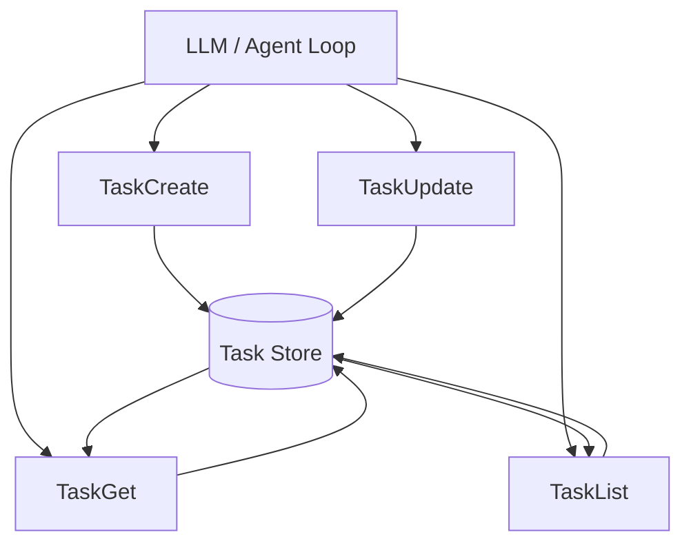
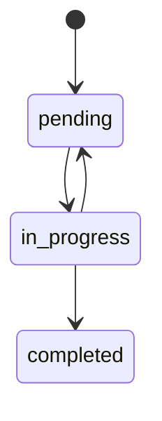
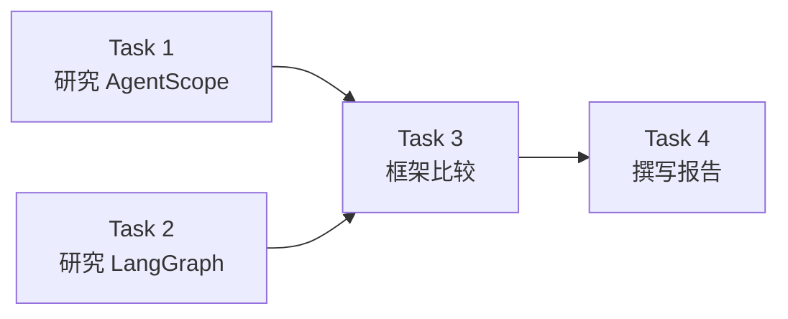
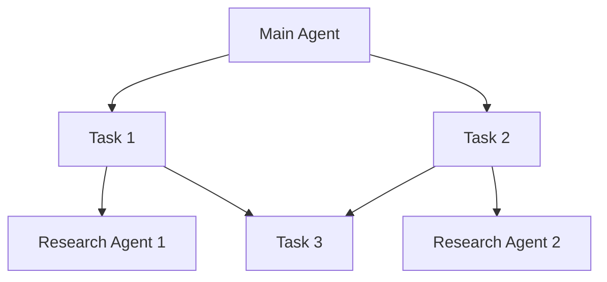
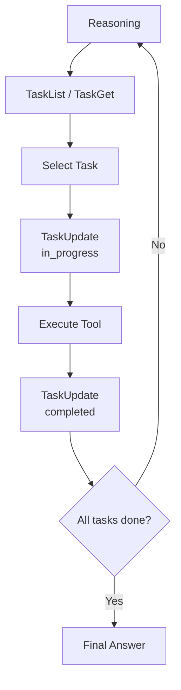
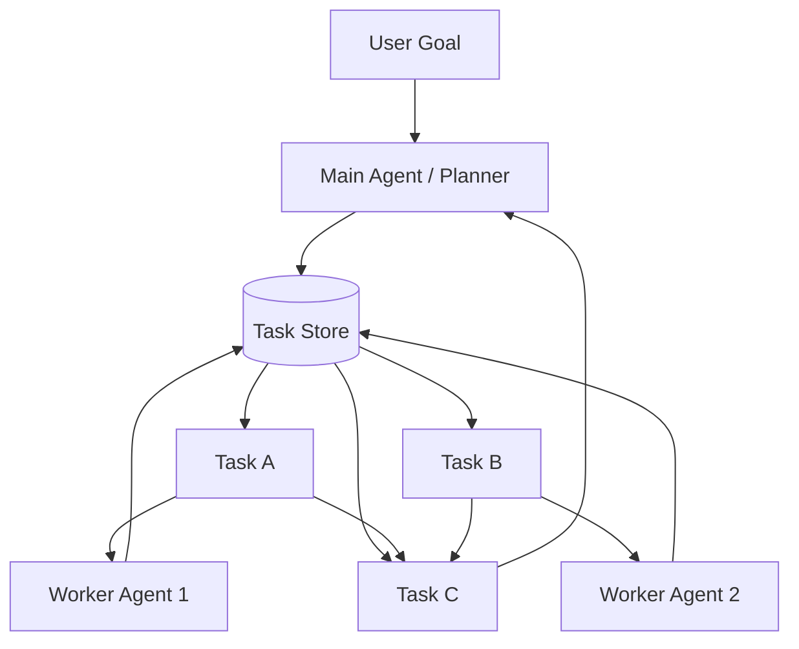

# Agent Task 工具四件套设计总结

## 1. 设计目标

Task 工具四件套的核心不是“给 Agent 加一个 TODO List”，而是：

> **把任务计划从 LLM 的自然语言思考中剥离出来，变成 Agent 可以主动读写的结构化外部状态。**

典型的四个工具：

- `TaskCreate`
- `TaskGet`
- `TaskList`
- `TaskUpdate`

它们共同维护一个独立于对话上下文的 **Task Store**。

这样，Agent 不需要完全依赖上下文记住：

- 有哪些任务；
- 当前做到哪一步；
- 哪些任务已经完成；
- 哪些任务被其他任务阻塞；
- 哪些任务可以并行执行；
- 某个任务由哪个 Agent 执行。

---

# 2. 整体架构



整个系统可以分成三层：

```text
LLM / Agent
     │
     ▼
Task Tool Interface
     │
     ▼
Task Store
     │
     ├── Task State
     ├── Dependency DAG
     └── Owner / Metadata
```

分别对应：

1. **Tool Interface**：允许 LLM 通过标准 Tool Call 操作任务；
2. **Task Store**：真正保存结构化任务状态；
3. **Planning Semantics**：定义任务状态、依赖关系、执行者等语义。

---

# 3. Task 数据模型

一个比较完整的 Task 可以设计为：

```json
{
  "id": "task_3",
  "subject": "比较 AgentScope 与 LangGraph",
  "description": "从 Agent Loop、状态管理、工具、Context、Multi-Agent 和部署能力进行比较",
  "status": "pending",
  "owner": "main-agent",
  "blockedBy": ["task_1", "task_2"],
  "blocks": ["task_4"],
  "result": null,
  "metadata": {}
}
```

推荐至少包含以下字段：

| 字段 | 作用 |
|---|---|
| `id` | Task 唯一标识 |
| `subject` | 简短任务名称 |
| `description` | 任务详细说明 |
| `status` | 当前生命周期状态 |
| `owner` | 当前执行该任务的 Agent |
| `blockedBy` | 当前任务依赖哪些任务 |
| `blocks` | 当前任务会阻塞哪些后续任务 |
| `result` | 任务完成后的结果摘要或引用 |
| `metadata` | 扩展信息 |

---

# 4. 四个 Task Tool 的职责

## 4.1 TaskCreate

### 作用

创建新的结构化任务。

概念接口：

```python
TaskCreate(
    subject: str,
    description: str | None = None,
    owner: str | None = None,
    blocked_by: list[str] | None = None
) -> Task
```

例如：

```text
TaskCreate(
    subject="研究 AgentScope",
    description="整理 AgentScope 的 Agent、Toolkit、Context、Memory 与 Team 设计"
)
```

产生：

```text
task_1
status = pending
```

### 设计重点

`TaskCreate` 不应该只是向数组 append 一个字符串。

它创建的是一个具有：

- ID；
- 状态；
- 描述；
- 依赖；
- Owner；

的正式工作单元。

---

# 5. TaskGet

## 5.1 作用

获取单个任务的完整详情。

```python
TaskGet(task_id: str) -> Task
```

例如：

```text
TaskGet("task_3")
```

返回：

```text
Task #3

subject:
比较 AgentScope 和 LangGraph

status:
pending

owner:
main-agent

blockedBy:
task_1
task_2

blocks:
task_4
```

### TaskGet 的核心语义

```text
TaskGet = 单任务详情
```

适合回答：

> “这个任务具体是什么？”

---

# 6. TaskList

## 6.1 作用

读取整个 Task Board 的全局状态。

```python
TaskList(
    status: str | None = None,
    owner: str | None = None
) -> list[TaskSummary]
```

例如：

```text
TaskList()
```

得到：

```text
#1 [completed] 研究 AgentScope

#2 [in_progress] 研究 LangGraph

#3 [pending] 比较两个框架
   blockedBy: #2

#4 [pending] 撰写报告
   blockedBy: #3
```

### TaskList 的核心语义

```text
TaskList = 全局任务看板
TaskGet  = 单个任务详情
```

TaskList 最重要的价值是让 Agent 在执行长任务过程中快速回答：

> **“整个项目现在做到哪里了？”**

而不需要重新阅读几十轮 Conversation History。

---

# 7. TaskUpdate

## 7.1 作用

修改 Task 的运行状态。

例如：

```python
TaskUpdate(
    task_id="task_1",
    status="in_progress"
)
```

完成后：

```python
TaskUpdate(
    task_id="task_1",
    status="completed",
    result="AgentScope 架构调研已经完成"
)
```

除了状态，TaskUpdate 通常还可以修改：

```text
status
owner
blockedBy
blocks
description
result
metadata
```

所以在四件套中：

> **TaskUpdate 是让 Task System 真正具有动态性的关键工具。**

---

# 8. Task 生命周期状态机

最简单的任务生命周期：



更完整的系统还可以增加：

```text
pending
in_progress
completed
failed
cancelled
blocked
```

推荐不要把 `blocked` 一定实现成真正存储状态。

也可以通过：

```text
status = pending
+
blockedBy 中存在未完成任务
```

动态推导：

```text
effective_status = blocked
```

这样能避免：

```text
status
dependency state
```

两份信息不同步。

---

# 9. Dependency DAG

Task System 比普通 TODO List 更重要的地方是：

> **Task 之间可以存在显式依赖关系。**

例如：



表示：

```text
Task 3.blockedBy = [Task 1, Task 2]

Task 1.blocks = [Task 3]
Task 2.blocks = [Task 3]

Task 4.blockedBy = [Task 3]
```

因此 Task System 本质上可以形成：

> **Task Dependency DAG**

而不是简单线性 Todo List。

---

# 10. 如何判断任务是否可以执行

可以定义：

```python
def is_runnable(task, task_store):
    if task.status != "pending":
        return False

    for task_id in task.blocked_by:
        dependency = task_store.get(task_id)

        if dependency.status != "completed":
            return False

    return True
```

于是系统可以自然找到：

```text
当前所有 runnable tasks
```

例如：

```text
Task A ──┐
         ├── Task C
Task B ──┘
```

如果 A、B 都没有依赖：

```text
A runnable
B runnable
```

两者就可以并行执行。

---

# 11. Task 与 Multi-Agent 的关系

非常重要的一点：

```text
Task ≠ Agent
```

两者分别回答：

```text
Task  = What needs to be done?
Agent = Who executes it?
```

因此：

```text
TaskCreate
```

只负责：

```text
创建工作项
```

并不意味着：

```text
创建 SubAgent
```

---

## 11.1 Owner 字段

可以利用：

```text
owner
```

建立 Task 与 Agent 的关联。

例如：

```text
Task 1
subject = 搜集 AgentScope 资料
owner = researcher-1

Task 2
subject = 搜集 LangGraph 资料
owner = researcher-2
```

形成：



这样：

> **Task 是 Work State，Agent 是 Worker。**

这个抽象比“让多个 Agent 互相聊天”更适合真实工程系统。

---

# 12. 一次完整执行流程

假设用户要求：

> 分析项目架构、找问题、修代码并运行测试。

Agent 第一次 reasoning 后：

```text
TaskCreate("分析项目架构")
→ Task #1

TaskCreate("寻找潜在问题", blockedBy=[#1])
→ Task #2

TaskCreate("修复代码", blockedBy=[#2])
→ Task #3

TaskCreate("运行测试", blockedBy=[#3])
→ Task #4
```

初始 Task Board：

```text
#1 pending

#2 pending
blockedBy: #1

#3 pending
blockedBy: #2

#4 pending
blockedBy: #3
```

Agent 开始：

```text
TaskUpdate(#1, in_progress)
```

然后调用：

```text
Glob
Read
Grep
...
```

完成后：

```text
TaskUpdate(#1, completed)
```

此时：

```text
#2 automatically becomes runnable
```

继续：

```text
TaskUpdate(#2, in_progress)
```

直到：

```text
#1 completed
#2 completed
#3 completed
#4 completed
```

---

# 13. Task System 如何嵌入 Agent Loop

普通 ReAct：

```text
Reason
  ↓
Act
  ↓
Observe
  ↓
Reason
```

加入 Task System 后：

```text
Reason
  ↓
Read Task State
  ↓
Select Runnable Task
  ↓
TaskUpdate(in_progress)
  ↓
Execute Tools
  ↓
TaskUpdate(completed)
  ↓
Read Task State
  ↓
Continue Reasoning
```

也就是：



---

# 14. 为什么它属于 Harness-Level Planning

Agent Planning 可以粗略分为三个层级。

## 14.1 Prompt-Level Planning

```text
Please make a plan first.
```

模型输出：

```text
1. 搜资料
2. 比较
3. 写报告
```

问题：

```text
Plan 只存在于自然语言上下文中。
```

---

## 14.2 Structured Planning

模型输出：

```json
{
  "steps": [
    "research",
    "compare",
    "write"
  ]
}
```

已经有结构，但通常仍属于：

```text
一次模型输出
```

---

## 14.3 Stateful / Harness-Level Planning

```text
LLM
 ↕
TaskCreate / Get / List / Update
 ↕
Persistent Task Store
 ↕
Status / Dependency / Owner
```

计划已经变成：

> **运行时环境中的外部状态。**

因此即使：

- Context 被压缩；
- Agent 被中断；
- Agent 切换；
- 子 Agent 并行执行；
- Session 恢复；

Task State 仍然可以继续存在。

---

# 15. Task 与 Context Management 的关系

这是 Task 系统最大的工程价值之一。

假设 Agent 已经运行了：

```text
100 个 reasoning / tool steps
```

Conversation History 太长，系统执行：

```text
Context Compression
```

早期消息：

```text
删除 / 总结
```

如果任务计划只存在于：

```text
Assistant Message:
“接下来我要完成 A、B、C、D。”
```

那么 Context Compression 后计划可能被弱化甚至遗失。

Task Store 则独立存在：

```text
Task Store

#1 completed
#2 completed
#3 in_progress
#4 pending
```

Agent 只需要：

```text
TaskList()
```

就能快速恢复执行状态。

因此：

> **Task State 应该独立于 Active Context。**

---

# 16. Task 与 Checkpoint 的区别

两者很容易混淆。

## Checkpoint

主要回答：

> **Agent Runtime 当前运行到了哪里？**

例如保存：

```text
messages
graph state
tool state
interrupt state
thread state
```

---

## Task Store

主要回答：

> **这个工作本身完成到哪里了？**

例如：

```text
哪些任务存在？
哪些任务完成？
哪些任务被阻塞？
谁负责哪个任务？
```

可以记：

```text
Checkpoint = Runtime State
Task Store  = Work State
Context     = Model 当前看到的信息
Agent       = Worker
```

这四者职责不同。

---

# 17. Task 与 SubAgent 的典型组合

一个比较成熟的 Multi-Agent Harness 可以设计为：



主 Agent 可以：

1. 创建 Task DAG；
2. 找出可执行任务；
3. fork / spawn Worker；
4. 设置 Task Owner；
5. Worker 完成任务；
6. 更新 Task 状态；
7. Main Agent 收集结果；
8. 执行后继任务。

---

# 18. 推荐的数据层接口

真正实现时，不建议让四个 Tool 直接维护一个全局 List。

可以抽象：

```python
class TaskRepository:

    def create(self, task):
        ...

    def get(self, task_id):
        ...

    def list(self, filters=None):
        ...

    def update(self, task_id, patch):
        ...
```

Tool 只做：

```text
LLM Tool Call
     ↓
参数校验
     ↓
Task Service
     ↓
Task Repository
```

完整分层：

```text
Agent
  ↓
Task Tools
  ↓
Task Service
  ↓
Task Repository
  ↓
Redis / DB / Memory
```

这样以后可以轻松把：

```text
In-Memory Store
```

替换成：

```text
Redis
MySQL
PostgreSQL
Checkpoint Storage
```

---

# 19. Task Service 推荐负责的逻辑

不要把所有逻辑写在 Tool Handler 里。

推荐单独：

```python
class TaskService:
    ...
```

负责：

```text
创建 Task
检查 dependency
检查循环依赖
状态迁移校验
owner 分配
runnable task 查询
任务完成后的 dependency release
```

例如：

```python
def complete_task(task_id):
    task = repo.get(task_id)

    validate_transition(
        old=task.status,
        new="completed"
    )

    repo.update(
        task_id,
        {"status": "completed"}
    )
```

---

# 20. Dependency 设计注意点

## 20.1 必须防止循环依赖

错误情况：

```text
A blockedBy B
B blockedBy C
C blockedBy A
```

形成：

```text
A → B → C → A
```

整个任务永远无法执行。

因此：

```text
TaskCreate
TaskUpdate
```

修改 dependency 时，应检查 DAG 是否存在 cycle。

---

## 20.2 blocks 可以考虑不持久化

事实上：

```text
blockedBy
```

就足以表示依赖关系。

例如：

```text
C.blockedBy = [A, B]
```

那么：

```text
A.blocks
```

完全可以反向查询得到。

因此有两种方案。

### 方案 A：双向存储

```text
blockedBy
blocks
```

优点：

```text
查询快
```

缺点：

```text
容易数据不一致
```

### 方案 B：只存 blockedBy

```text
blocks 动态计算
```

优点：

```text
数据源单一
一致性好
```

对于个人项目，我更推荐：

> **只持久化 blockedBy，blocks 通过索引或查询动态得到。**

---

# 21. TaskUpdate 的状态迁移校验

不要允许任意状态修改。

例如：

```text
completed
↓
in_progress
```

是否允许？

应该由业务规则决定。

可以显式定义：

```python
ALLOWED_TRANSITIONS = {
    "pending": {
        "in_progress",
        "cancelled"
    },

    "in_progress": {
        "completed",
        "failed",
        "pending"
    },

    "failed": {
        "pending",
        "cancelled"
    },

    "completed": set(),

    "cancelled": set()
}
```

这样 TaskUpdate 不只是：

```text
UPDATE tasks SET status = ?
```

而是在执行：

> **Task State Machine Transition**

---

# 22. Task Result 的设计

任务完成后不要只保存：

```text
status = completed
```

最好同时保存：

```text
result
```

例如：

```json
{
  "id": "task_1",
  "status": "completed",
  "result": {
    "summary": "发现三个核心模块...",
    "artifacts": [
      "workspace://reports/architecture.md"
    ]
  }
}
```

这样后续 Agent 不需要重新阅读整个历史。

只需要：

```text
TaskGet(task_1)
```

就能看到：

```text
任务结论
+
关键 artifact reference
```

这也是 Context Offloading 的一种思路。

---

# 23. Task 四件套与 Todo List 的区别

普通 Todo：

```text
[ ] 查资料
[ ] 写代码
[ ] 测试
```

适合：

```text
简单 Checklist
```

Task System：

```text
Task
├── id
├── description
├── status
├── owner
├── dependency
├── result
└── metadata
```

适合：

```text
长任务
多阶段任务
并行任务
Multi-Agent
Context Compression
任务恢复
```

因此：

```text
Todo = Checklist

Task System = Work State Management
```

---

# 24. 一个最小可用实现

最小版本实际上非常简单。

```python
from dataclasses import dataclass, field


@dataclass
class Task:
    id: str
    subject: str
    description: str = ""
    status: str = "pending"
    owner: str | None = None
    blocked_by: list[str] = field(default_factory=list)
    result: str | None = None


class TaskStore:

    def __init__(self):
        self.tasks = {}

    def create(self, task):
        self.tasks[task.id] = task
        return task

    def get(self, task_id):
        return self.tasks[task_id]

    def list(self):
        return list(self.tasks.values())

    def update(self, task_id, **kwargs):
        task = self.tasks[task_id]

        for key, value in kwargs.items():
            setattr(task, key, value)

        return task
```

然后包装成四个 Tool：

```python
def task_create(...):
    ...

def task_get(task_id):
    ...

def task_list():
    ...

def task_update(task_id, ...):
    ...
```

到这里已经可以支持一个基本 Agent。

---

# 25. 进一步升级方向

在最小实现上，可以逐步增加：

## 第一阶段

```text
Task CRUD
+
status
```

## 第二阶段

```text
blockedBy
+
Dependency DAG
```

## 第三阶段

```text
owner
+
SubAgent assignment
```

## 第四阶段

```text
result
+
artifact reference
```

## 第五阶段

```text
Task persistence
+
checkpoint restore
```

## 第六阶段

```text
Task scheduler
+
parallel worker execution
```

最终形成：

```text
Planner
   ↓
Task DAG
   ↓
Scheduler
   ↓
Workers / SubAgents
   ↓
Task Result
   ↓
Planner
```

---

# 26. 最终设计总结

Task 工具四件套：

```text
TaskCreate
TaskGet
TaskList
TaskUpdate
```

表面上只是四个 Tool。

但从 Agent Harness 设计角度，它真正解决的是：

```text
LLM 的自然语言计划
        ↓
结构化外部 Task State
        ↓
状态机
        ↓
依赖 DAG
        ↓
任务调度
        ↓
SubAgent 分工
        ↓
长任务恢复
```

因此它的核心价值可以总结为：

> **将 Agent 的“工作计划”从模型内部隐式认知状态，转化为可持久化、可查询、可修改、可恢复、可调度的显式环境状态。**

进一步可以用四句话区分整个 Agent Harness 中的几个核心状态：

```text
Context     = 模型当前看到什么

Task Store  = 工作当前做到哪里

Checkpoint  = Runtime 当前运行到哪里

Agent       = 谁负责执行工作
```

四者结合以后，Agent 才真正具备处理：

- 长链路任务；
- 多阶段任务；
- 多 Agent 协作；
- 上下文压缩；
- 中断恢复；
- 并行调度；

的工程基础。

---

# 27. 一句话记忆

> **Task 四件套不是 TODO 工具，而是 Agent Harness 中用于外部化 Planning State 的最小任务状态管理系统。**
