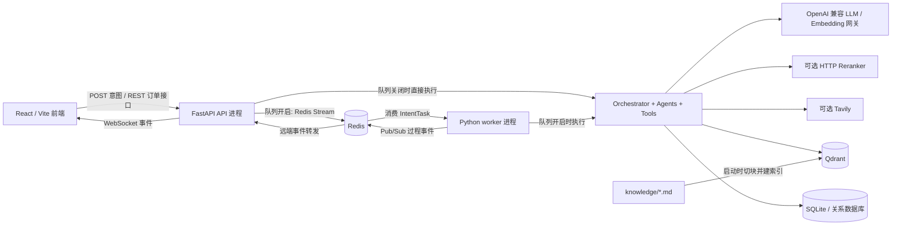
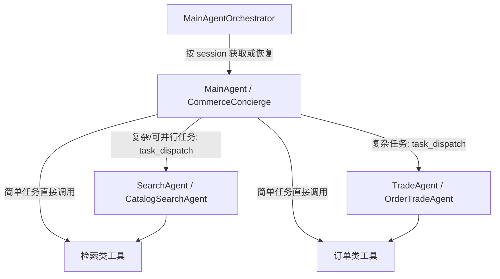
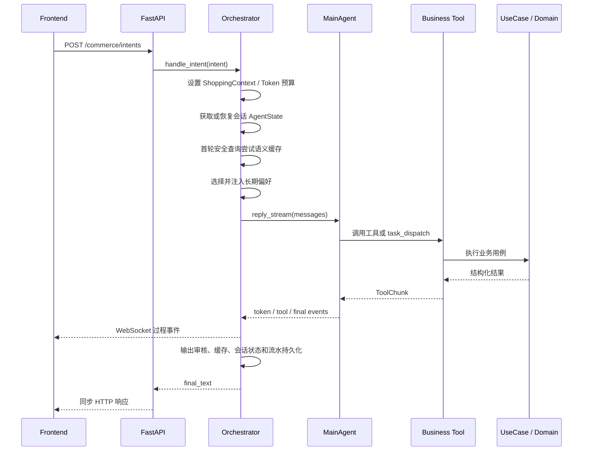

# Globex 项目架构说明（面向大模型）

> 文档快照：2026-08-26  
> 事实来源：参考项目的仓库代码，而不是仅依据 `README.md` 或设计文档。  
> 用途：帮助后续开发者或大模型在修改代码前，准确理解系统边界、依赖方向、运行时链路和已知限制。

## 1. 一句话定义

Globex 是一个基于 AgentScope 2.x 的跨境电商对话式 Agent 示例系统：FastAPI 接收买家的自然语言意图，MainAgent 直接调用业务工具或按需派发 SearchAgent / TradeAgent，应用层用例负责检索、计价和订单操作，React 前端通过 REST 获取最终结果、通过 WebSocket 接收过程事件。

它是教学 / MVP 工程，不是完整电商平台。当前系统没有支付、物流、用户认证、真实商品主数据、持久化库存或生产级数据库迁移。

## 2. 阅读约定：不要混淆这些概念

| 名称 | 准确定义 | 不应理解为 |
|---|---|---|
| `shopping_session_id` | 一段对话的关联 ID，也是 MainAgent 状态和事件订阅的分区键 | 已认证用户会话 |
| `buyer_id` | 请求方传入的买家标识；工具从 `ShoppingContext` 读取它 | 经过鉴权的用户身份 |
| MainAgent | 每个会话长期复用的 AgentScope `Agent` 实例 | 只做路由、不做业务的纯调度器 |
| SearchAgent / TradeAgent | `task_dispatch` 每次调用时临时创建的专家 Agent | 常驻服务或独立进程 |
| Task 工具 | AgentScope 内置的 `TaskCreate/Update/List/Get`，保存 Agent 的计划状态 | Redis 中的异步意图任务 |
| 意图任务 | `IntentTask`，可写入 Redis Stream 交给 worker 执行 | AgentScope 的 Task 计划项 |
| 会话状态 | 完整 `AgentState` 快照，用于恢复多轮上下文 | 对话审计流水 |
| 对话流水 | 买家/Agent 最终文本和非 token 事件，用于记录和分析 | Agent 推理所直接加载的上下文 |
| 商品知识 | `knowledge/*.md` 经 RAG 返回的品类选购常识 | 可购买商品目录 |
| 商品目录 | `seed_products.py` 构造的进程内 `Product` / `Sku` 对象 | 数据库中的商品与库存主表 |
| Qdrant 商品索引 | 商品文本向量到 `product_id` 的检索索引 | 商品事实或库存的权威数据源 |

## 3. 系统全景



运行时有两种互斥的意图执行拓扑：

- 未配置 `REDIS_URL`，或 `QUEUE_ENABLED=0`：API 进程直接调用 orchestrator。
- Redis 可用且 `QUEUE_ENABLED=1`：API 只入队；worker 进程调用 orchestrator。同步接口仍会等待 worker 结果，异步接口立即返回 `task_id`。

## 4. 分层与依赖方向

代码采用“DDD 风格洋葱分层”，但不是严格的 Clean Architecture。

```text
presentation  ──────┐
                    v
application  ───> domain <── infrastructure 中的端口实现
     │              ^                    │
     └──────────────┴────────────────────┘
                    composition.py 统一装配
```

| 层 | 目录 | 职责 | 允许依赖 |
|---|---|---|---|
| Domain | `app/domain/` | 实体、值对象、订单状态机、库存操作、计价规则、Repository / Store / Queue 端口 | 标准库和同层代码 |
| Application | `app/application/` | Agent 工厂、orchestrator、工具适配、用例、提示词、记忆选择、运行时护栏 | Domain；当前实现也直接依赖部分 Infrastructure 类型 |
| Infrastructure | `app/infrastructure/` | LLM、Embedding、Qdrant、Redis、SQL/JSON 存储、事件总线、缓存、队列、熔断、追踪、安全过滤 | Domain 端口、部分 Application 协议 |
| Presentation | `app/presentation/` | FastAPI、REST/WS DTO、连接管理、HTTP 错误映射 | Application、Composition、少量 Infrastructure 状态 |
| Composition Root | `app/composition.py` | 创建依赖并把端口接到实现；API 和 worker 共用 | 全部层 |

关键判断：Domain 基本保持纯净；Application 中的 Agent 工厂直接使用 `Settings`、`TradeEventBus`、`create_chat_model` 等 Infrastructure 类型，因此不能声称依赖方向完全反转。

## 5. Agent 拓扑与职责



### 5.1 MainAgent

`MainAgentFactory` 为主 Agent 注册：

- 检索类工具：`product_search_tool`、`category_insight_tool`、可选 `web_search_tool`；
- 订单类工具：`create_order_tool`、`query_order_tool`、`cancel_order_tool`；
- 计划工具：`TaskCreate`、`TaskUpdate`、`TaskList`、`TaskGet`；
- 子 Agent 调度：`task_dispatch`；
- 长期偏好写入/撤回：`remember_preference_tool`、`forget_preference_tool`。

默认策略是 MainAgent 直接完成简单任务。只有子任务可并行、需要上下文隔离或内部调用链较深时，提示词才要求使用 `task_dispatch`。这是一条模型行为约束，不是硬编码路由规则。

`SessionRegistry` 按 `shopping_session_id` 缓存 MainAgent。每轮结束后保存完整 `AgentState`，服务重启后尝试恢复。SearchAgent 和 TradeAgent 不复用状态，每次派发都新建实例。

### 5.2 SearchAgent

SearchAgent 拥有三类能力：

- 商品检索：查询商品向量索引，必要时调用 reranker；
- 品类洞察：查询 `knowledge/*.md` 建成的 RAG 知识库；
- 可选联网搜索：只有配置 `TAVILY_API_KEY` 才注册。

检索子 Agent 可由服务端自动注入与当前任务相关的买家偏好。TradeAgent 不注入偏好，因为它只应执行已确定的 `product_id` / `sku_id`。

### 5.3 TradeAgent

TradeAgent 只负责创建、查询、取消订单。金额、库存和状态迁移由工具下方的 UseCase / Domain 计算，Agent 不应自行计算。

“创建/取消前先给用户确认卡”主要由系统提示词约束。工具权限规则会放行这些已知业务写工具；没有通用的人机审批服务在工具调用层再次确认。

## 6. 一次意图的完整处理链

### 6.1 对外接口

| 接口 | 执行语义 |
|---|---|
| `POST /commerce/intents` | 提交意图并等待最终文本；队列开启时内部仍是入队后等待 |
| `POST /commerce/intents/async` | 仅在队列开启时可用；立即返回 `task_id` |
| `GET /commerce/tasks/{task_id}` | 返回 `queued/running/done/failed`、最终文本或错误 |
| `WS /commerce/events` | 按 `shopping_session_id` 订阅过程事件 |
| `GET /commerce/orders/{order_id}` | 绕过 Agent，直接查询订单 UseCase |
| `POST /commerce/orders/{order_id}/cancel` | 绕过 Agent，直接取消订单 UseCase |
| `GET /health` | 报告进程、数据库、Redis、缓存和队列状态 |

orchestrator 会捕获大部分 Agent 异常并把最终文本写成 `[error] ...`，因此 `POST /commerce/intents` 可能返回 HTTP 200 但业务结果是错误文本。调用方不能只按 HTTP 状态判断意图是否成功。

### 6.2 队列关闭：API 进程直跑



### 6.3 队列开启：API 入队、worker 执行

1. API 对 `shopping_session_id + raw_query` 做 SHA-256 指纹，并用 Redis `SET NX` 建立 10 分钟入队幂等键。
2. API 将 `IntentTask` 写入正常流或“大请求”流，并写入 `queued` 状态。
3. worker 通过消费者组领取任务，将状态改为 `running`，再调用同一个 `MainAgentOrchestrator`。
4. worker 把事件发布到本地 `TradeEventBus`，总线再通过 Redis Pub/Sub 广播。
5. API 的事件背板监听器收到远端事件，转发到本进程 WebSocket 订阅者。
6. worker 完成后写入 `done + final_text`；同步接口优先等 `final.result`，同时每 2 秒轮询任务状态兜底。
7. `/commerce/intents/async` 不等待结果；调用方通过 `/commerce/tasks/{task_id}` 轮询或监听 WebSocket。

Redis Stream 的设计语义是 at-least-once，不是 exactly-once。入队幂等键可抑制短时间内的重复提交，但不能等价为完整的订单业务幂等。

## 7. 商品检索和到手价链路

`CatalogSearchUseCase` 的实际算法：

```text
normalized_query
  -> EmbeddingClient.embed
  -> Qdrant 向量召回 top 8 product_id
  -> ProductRepository 还原进程内 Product
  -> 可选 HTTP rerank
  -> ship_to / price_max_major 硬过滤
  -> 截取 top_k
  -> 可选内联 landed_price
  -> 商品卡 JSON
```

降级链如下，返回字段 `recall_strategy` 会明确标记实际路径：

1. `embedding_rerank`：向量召回和 rerank 都成功；
2. `embedding_only`：reranker 未配置或失败；
3. `keyword_2gram`：embedding / Qdrant 失败或没有向量候选，使用空格词元加中文 2-gram 匹配内存商品。

硬约束由代码过滤，而不是交给模型自行判断：

- `ship_to` 不在商品的 `ships_to` 时过滤；
- 商品主 SKU 折算后的价格超过 `price_max_major` 时过滤；
- 被过滤候选最多返回 3 条摘要到 `filtered_out`，避免模型把“存在但不满足约束”误说成“不存在”。

传入 `ship_to` 时，`TariffSchedule` 按“商品小计 + 运费 + 关税”生成 `landed_price`。汇率、关税率、免税额度和基础运费都是仓库内的简化静态规则，不是实时外部报价。

品类洞察 RAG 与商品索引使用不同 Qdrant collection：默认分别为 `globex_category_kb` 和 `globex_products`。RAG 只返回知识片段，不返回可购买商品。

## 8. 订单领域模型

核心聚合为 `Order`，订单行指向 `product_id + sku_id`。

```text
DRAFT --confirm--> CONFIRMED --cancel(reason)--> CANCELLED
```

当前 `Order.place()` 创建后立即调用 `confirm()`，因此外部正常观察到的新订单直接是 `CONFIRMED`。

领域不变量：

- 订单至少有一条订单行；
- 全部订单行币种一致；
- 创建时检查 Product / SKU 存在和库存，并扣减进程内库存；
- 创建中途失败会回滚本次已扣库存；
- 只有 `CONFIRMED` 可取消，且取消原因必填；
- 取消后回补进程内库存；
- 金额使用最小货币单位保存，最终快照才转为主单位。

`GET /commerce/orders/{order_id}` 和 `POST /commerce/orders/{order_id}/cancel` 直接调用 UseCase，不经过 Agent。尤其是 REST 取消接口没有 Agent 提示词中的“确认卡”流程。

## 9. 状态、存储与数据所有权

| 数据 | 权威来源 / 实现 | 生命周期 | 重要说明 |
|---|---|---|---|
| 商品目录与库存 | 每个进程自己的 `InMemoryProductRepository`，由 `seed_products.py` 初始化 | 进程级 | 不进 SQL；重启恢复种子库存；API 与 worker、多个 worker 之间不共享库存 |
| 商品向量 | Qdrant `globex_products` | 持久或服务级 | 只保存向量和 `product_id`，不是商品事实表 |
| 品类知识向量 | Qdrant `globex_category_kb` | 持久或服务级 | 源文件是 `knowledge/*.md` |
| 订单 | 默认 SQL `orders` + `order_items` | 持久 | `DATABASE_URL=file` 时退化为进程内订单，不会写 JSON |
| MainAgent 状态 | SQL `agent_session_states`；file 模式为 JSON | 每轮覆盖 | 用于恢复 Agent 上下文、摘要、Task 计划等 |
| 对话文本 | SQL `conversation_messages`；file 模式为 JSON | 追加 | 每轮写 buyer 和 agent 两条 |
| 过程事件 | SQL `conversation_events`；file 模式为 JSON | 追加 | `token.delta` 不入库，其他本轮事件批量写入 |
| 买家偏好 | SQL `buyer_preferences`；file 模式为 JSON | 跨会话 | 按 buyer 读取；删除使用 statement 精确匹配 |
| 语义缓存 | Redis | 24 小时 | 按模型、prompt 指纹、buyer 和偏好指纹分桶；每桶最近 30 条 |
| Embedding 缓存 | Redis | 缓存级 | 由 `CachedEmbeddingClient` 使用 |
| 意图队列 / 状态 | Redis Stream + Redis key | 任务级 | 状态 key 默认 1 小时；队列开启才存在 |
| 实时事件背板 | Redis Pub/Sub | 瞬时 | 不保证离线补发；WebSocket 断线期间的事件可能丢失 |

默认 `DATABASE_URL` 是 `DATA_DIR/globex.db` 对应的 SQLite。特殊值 `file` 才选择 JSON / 内存退化实现。SQL 模式启动时使用 `create_all` 建表，没有 Alembic 迁移。

## 10. 长期偏好与语义缓存

长期偏好的写路径是 MainAgent 调用 remember / forget 工具；读路径由 orchestrator 在模型调用前注入 `<buyer-preferences>` 消息。

- 所有 `dislike` 都保留，不受 `top_k` 截断；
- `like` 默认按时间选择最近若干条；开启 `PREFERENCE_RELEVANCE_ENABLED` 后按 query 相似度选择；
- 检索子 Agent 会再次由服务端注入偏好，避免依赖 MainAgent 手工复制；
- 同一会话中偏好文本未变化时不会重复注入；
- 偏好新增或撤回会改变语义缓存分桶，使旧偏好下生成的回复自然失效。

语义缓存只对无历史上下文且未命中写操作 / 指代型关键词的请求生效。命中后跳过整轮模型调用，但仍执行最终输出审核、发布 `cache.hit` / `final.result` 并记录对话。

## 11. 事件模型与前端

`TradeEventBus` 按会话分发以下事件：

```text
agent.dispatch
tool.invoke
tool.result
token.delta
plan.update
context.compressed
model.fallback
cache.hit
task.queued
task.started
final.result
error
```

前端调用同步 `/commerce/intents`，但不使用 HTTP 响应正文来追加 Agent 消息，而是依赖 WebSocket 的 `final.result`。商品卡直接取最近一次 `tool.result.payload.hits` 渲染，无需额外商品详情接口。

WebSocket 连接后的第一条客户端消息必须是：

```json
{"shopping_session_id": "..."}
```

当前前端 `TradeEventType` 联合类型没有列出 `cache.hit`、`task.queued` 和 `task.started`，但运行时仍能收到这些事件；时间线会用原始事件名兜底显示。这是类型声明不完整，不代表后端没有这些事件。

## 12. 韧性、安全与可观测性

### 12.1 模型调用

- 所有 Agent 工厂共享一个 `GatewayThrottle`，统一限制并发和相邻请求起跑间隔；
- 流式调用会持有并发名额直到流被消费完；
- 瞬时故障在模型层指数退避重试，耗尽后可切备用模型并发布 `model.fallback`；
- orchestrator 外层还会对流中途或工具链引发的瞬时错误做整轮兜底重试；
- 可配置回复 Token 上限，以及请求级 Token 预算和备用模型档位。

### 12.2 工具调用

- `ToolResilienceMiddleware` 为工具提供分级超时和三态熔断；
- 熔断默认按进程共享；开启 `BREAKER_SHARED` 且 Redis 可用时跨实例共享；
- MainAgent 还挂载 `HarnessToolMiddleware`：调用顺序检查、循环检测、结果 schema 检查和 L3 提示词注入过滤；
- SearchAgent / TradeAgent 当前只挂韧性中间件，不挂 Harness 工具中间件。

### 12.3 最终输出和追踪

- orchestrator 在 `final.result` 前做 L4 正则审核并脱敏内部信息；
- 配置 `OTEL_EXPORTER_OTLP_ENDPOINT` 后启用 OpenTelemetry OTLP/HTTP trace；
- 未配置 OTLP 时 TracingMiddleware 仍在 Agent 上，但基本短路；
- `/health` 检查数据库和 Redis，并报告语义缓存、队列与队列深度；它当前不主动探测 LLM、Embedding、Qdrant 或 Reranker。

## 13. 配置驱动的能力开关

| 条件 / 配置 | 实际效果 |
|---|---|
| 缺少 `LLM_API_KEY` | `load_settings()` 抛错，API / worker 无法正常启动 |
| `QDRANT_URL` 为空 | 商品索引使用 `DATA_DIR/qdrant` 本地嵌入模式；知识库使用 `DATA_DIR/qdrant_kb` |
| `RERANKER_BASE_URL` 为空 | 检索降级为 `embedding_only` |
| `TAVILY_API_KEY` 为空 | 不向 Agent 注册 `web_search_tool` |
| `REDIS_URL` 为空 | Redis 缓存、语义缓存、队列、事件背板全部关闭；意图由 API 直跑 |
| `QUEUE_ENABLED=0` | 即使 Redis 可用也不创建队列 / 背板，API 直跑 |
| `DATABASE_URL=file` | 偏好、会话状态和对话流水走 JSON；订单走内存 |
| `DATABASE_URL` 未配置 | 默认 SQLite `DATA_DIR/globex.db` |
| `DRIFT_DETECT_ENABLED=1` | 开启轮末静默漂移检测；默认关闭 |
| `TOKEN_BUDGET_TOTAL>0` | 开启请求级 Token 预算档位和模型降级；默认关闭 |
| `REPLY_TOKEN_BUDGET>0` | 挂载 AgentScope 回复预算中间件；默认关闭 |

配置只允许由 `app/infrastructure/settings.py` 读取环境变量。其他模块应通过注入的 `Settings` 使用配置。

## 14. 关键不变量和信任边界

后续修改必须保持以下约束：

1. `buyer_id` 进入订单或偏好写工具时，以 `ShoppingContext` 中的请求上下文为准，不接受模型生成的 buyer 参数。
2. 商品、价格、库存、订单状态必须来自工具 / Domain 返回，不由模型编造或重算。
3. 价格上限和目的国可达性必须在检索代码中结构化过滤。
4. Qdrant 只返回候选 ID；完整商品必须回到 `ProductRepository` 还原。
5. 订单状态迁移必须经过 `Order` 聚合方法，不直接改字符串状态。
6. 会话 AgentState 与审计流水是两套数据，不能用其中一套直接替代另一套。
7. 跨进程事件必须经 Redis Pub/Sub 背板；进程内 `TradeEventBus` 本身不能跨进程。
8. 子 Agent 看不到 MainAgent 的完整历史；`demands` 必须自包含任务上下文，买家偏好由服务端补充。
9. 缓存、RAG、rerank、追踪等辅助能力失败时应降级；订单事实写入失败不能伪装成成功。

当前 HTTP / WebSocket API 没有认证和授权。`buyer_id`、`shopping_session_id`、`order_id` 都可能由客户端直接提供或猜测，因此不能把现有接口视为生产安全边界。

## 15. 已知限制：不要把它们误说成已解决

1. **库存不是持久化、全局一致的库存。** 每个 API / worker 进程都有独立的种子商品和库存副本。多 worker、进程重启、API 直连取消订单都会造成库存视图分离。
2. **订单 ID 生成不是高并发安全序列。** SQL 实现使用“当前订单数 + 1”，并发创建可能撞号。
3. **队列不是完整 exactly-once。** 入队指纹只覆盖 10 分钟内的相同会话和问句；写入订单后、消息 ack 前崩溃仍需要业务级幂等兜底。
4. **pending 自动恢复链路未完整接通。** `RedisStreamTaskQueue` 提供 `claim_stale()`，但当前 worker 消费循环没有调用它；而且该方法只处理正常流。不能宣称 worker 崩溃后一定会由现有代码自动回收全部 pending 任务。
5. **Redis Pub/Sub 不保存历史事件。** 前端重连只能接收重连后的新事件；最终结果可通过任务状态轮询补偿，但中间 token / 工具事件不能补发。
6. **SQLite 只适合本地 / 低并发。** WAL 和 busy timeout 只能缓解 API 与 worker 的写锁竞争，不能替代服务型数据库。
7. **`create_all` 不是迁移系统。** 表结构演进没有 Alembic 版本控制。
8. **确认卡主要是提示词约束。** REST 取消接口绕过 Agent；系统也没有通用审批状态机证明某次写操作已获得用户确认。
9. **到手价是静态简化规则。** 不是实时税务、物流或汇率服务结果。
10. **前端依赖 WebSocket 完成对话展示。** 若 HTTP 成功但 `final.result` 事件丢失，当前前端不会读取 HTTP `final_text` 作为展示兜底。
11. **尚未实现的演进项**包括 Hybrid BM25 + 向量 RRF、Bad Case 数据飞轮、Prompt A/B、记忆自进化和 Agent Skill 渐进加载；详见 `docs/教程实现对齐清单.md`。

## 16. 主要入口与修改导航

| 目标 | 首先阅读 / 修改 |
|---|---|
| 改 API 或生命周期 | `app/presentation/server.py` |
| 改 worker 消费 | `app/worker.py`、`app/infrastructure/queue/redis_stream_queue.py` |
| 换依赖实现或存储 | `app/composition.py` |
| 改一轮对话生命周期 | `app/application/agents/orchestrator.py` |
| 改 Agent 工具和策略 | `app/application/agents/*.py`、`app/application/prompts/globex.yml` |
| 改检索算法 / 过滤 | `app/application/usecases/catalog_search.py` |
| 改订单规则 | `app/application/usecases/order_usecases.py`、`app/domain/order/` |
| 改到手价 | `app/domain/shipping/tariff_schedule.py`、`app/domain/catalog/exchange_rate.py` |
| 改长期偏好 | `app/application/memory/`、`app/application/tools/*preference*`、`app/domain/buyer/` |
| 改持久化表和仓储 | `app/infrastructure/persistence/sql/` |
| 改事件契约 | `app/infrastructure/eventbus.py`、`frontend/src/types.ts` 和对应组件 |
| 改前端交互 | `frontend/src/App.tsx`、`frontend/src/components/` |
| 改启动配置 | `app/infrastructure/settings.py`、`.env.example`、`docker/docker-compose.yaml` |

## 17. 目录速查

```text
app/
├── domain/                 # 领域模型、规则、端口
├── application/
│   ├── agents/             # Main/Search/Trade Agent 与 orchestrator
│   ├── tools/              # Agent 可调用工具
│   ├── usecases/           # 检索和订单应用用例
│   ├── memory/             # 长期偏好选择与渲染
│   ├── harness/            # 断言、循环和漂移检测
│   └── prompts/            # YAML 系统提示词
├── infrastructure/         # 外部系统适配与运行时横切能力
├── presentation/           # FastAPI REST / WebSocket
├── composition.py          # 唯一装配根
└── worker.py               # Redis Stream 消费入口
frontend/                   # React 18 + Vite + TypeScript
knowledge/                  # 品类知识 Markdown 源文件
eval/                       # 评测数据
scripts/                    # 冒烟、并行验证、压测、评测脚本
tests/                      # 单元与集成测试
docker/                     # Compose 编排
docs/                       # 设计与实现对齐记录
```

## 18. 当前验证快照

在 2026-08-26 使用 `uv run pytest -q` 执行当前仓库测试：`289 passed, 2 failed`。两个失败都位于 `tests/test_retrieval.py`，表现为确定性测试 embedding 下露营灯预期 `P1008` 排第一、实际为 `P1039`。这不改变上述架构，但说明当前分支不能表述为“全部测试通过”。
