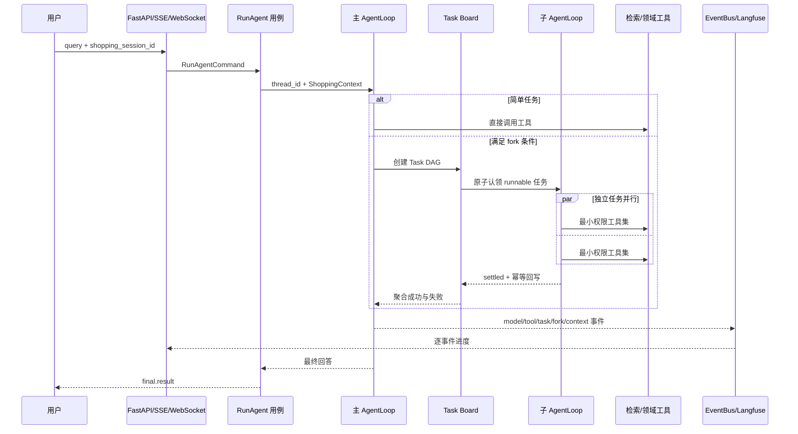

# Globex Agent 面试证据链

本目录是项目事实的统一入口。每条面试或简历结论都通过 Claim ID 连接到设计、代码、测试和绑定 Git Commit 的脱敏报告。

## 90 秒项目介绍

Globex Agent 是一个面向跨境购物决策的 Agent 平台。主 Agent 可直接查询品类知识、搜索商品、管理偏好和创建订单意向；复杂请求会进入 Task DAG，并派发给使用独立 `thread_id` 和最小工具集的子 Agent。平台用 LangGraph/LangChain 实现 Agent Runtime，用四层上下文、Cache Epoch 和 Breakpoint 控制长会话，用 OpenSearch Hybrid RRF + BGE 重排实现品类 RAG，用 BGE-M3 + FAISS + 交叉编码重排实现商品检索。

工程上采用 DDD-lite + Hexagonal：商品、Money、计价和订单规则位于 Domain；用例、任务编排和端口位于 Application；LangGraph、OpenSearch、Redis、SQLite 和 Langfuse 是可替换适配器。交易边界止于“订单意向”，不连接真实库存、支付、退款或第三方平台下单。

## 已发布快照

| 套件 | Run ID | Git Commit | 主要结论 | 状态 |
|---|---|---|---|---|
| Offline | `20260909T073736Z-offline` | `fa1ca544` | 170 tests、架构/编排/检索/业务/可靠性 | `verified` |
| Live E2E | `20260909T094839Z-live-e2e` | `bd67b9a` | 12 场景 × 3 次真实 Kimi，36/36 通过 | `verified` |
| Live Context | `20260909T141654Z-live-context` | `38e4fdf` | 3 模式 × 3 会话 × 8 轮真实 Kimi | `verified` |

三套快照均通过发布器的 Commit 绑定和脱敏扫描。最新指针见 [results/latest.json](results/latest.json)。

## 核心量化结论

- 多 Agent：30 轮 4 路 I/O 实验，P50 从 240 ms 降至 70 ms，加速 **3.43×**；重复认领和上下文泄漏均为 **0**，部分失败结果保留率为 **100%**。
- 上下文：`full` 相比 `off` 的 AgentLoop 输入 Token 从 43,974 降至 24,935，下降 **43.30%**；信息保留率和同 Epoch 稳定前缀率均为 **100%**。
- 真实 E2E：12 个规划场景各重复 3 次，**36/36 通过**；共观测 515,793 Token，未触发 250 请求/1,000,000 Token 硬上限。
- 品类 RAG：Hybrid + Reranker 在 100 条冻结集上达到 Recall@10 **94.44%**、MRR@10 **80.37%**、NDCG@10 **81.79%**、负例拒识率 **90%**。
- 商品搜索：Embedding + Reranker 在 67 条冻结集上达到 Recall@10 **96.27%**、MRR@10 **93.22%**、NDCG@10 **92.58%**。
- 个性化：在定向集上，开启画像后 MRR@10 提升 **6.67 个百分点**、NDCG@10 提升 **3.83 个百分点**，Recall@10 保持 100%。
- 可靠性：17 类故障注入 **17/17 通过**；正式离线快照共 **170 项测试通过**。

## Claim—代码—测试—报告

| Claim ID | 能力与状态 | 代码锚点 | 测试锚点 | 正式报告 |
|---|---|---|---|---|
| ARCH-001 `verified` | DDD-lite/Hexagonal 依赖隔离 | `app/domain`、`app/application`、`app/composition.py` | `tests/test_architecture.py` | [architecture.json](results/20260909T073736Z-offline/architecture.json) |
| ORCH-001 `verified` | Task DAG、并行、租约恢复、幂等与隔离 | `app/application/tasking`、`app/infrastructure/langchain/sub_agents` | `tests/test_tasking.py`、`tests/test_fork_sub_agents.py` | [orchestration.json](results/20260909T073736Z-offline/orchestration.json) |
| CTX-001 `verified` | Cache-aware 会话上下文治理 | `app/infrastructure/context_governance` | `tests/test_context_governance.py` | [context.json](results/20260909T141654Z-live-context/context.json) |
| RAG-001 `verified` | 品类知识 Hybrid RAG | `app/infrastructure/retrieval/category_insight` | `tests/test_opensearch_category_insight.py` | [category_hybrid_rerank.json](results/20260909T073736Z-offline/category_hybrid_rerank.json) |
| SEARCH-001 `verified` | 商品召回与重排 | `app/application/catalog/search_catalog.py` | `tests/test_item_search.py` | [product_embedding_rerank.json](results/20260909T073736Z-offline/product_embedding_rerank.json) |
| SEARCH-PERSONALIZATION-001 `verified` | User Tower 个性化 on/off | `app/application/catalog/fusion.py` | `tests/test_preferences.py` | [product_personalization.json](results/20260909T073736Z-offline/product_personalization.json) |
| COMMERCE-001 `verified` | 偏好、到手价和订单意向规则 | `app/domain`、`app/application/memory`、`app/application/orders` | 29 项专项测试 | [commerce-001.json](results/20260909T073736Z-offline/commerce-001.json) |
| REL-001 `verified` | 降级、重试、熔断和应急投影 | `app/infrastructure/langchain/reliability_middleware.py` | 故障注入测试 | [rel-001.json](results/20260909T073736Z-offline/rel-001.json) |
| E2E-001 `verified` | 真实 Kimi 工具路由与编排 | Agent Runtime 与工具集 | 固定 12 场景 | [live.json](results/20260909T094839Z-live-e2e/live.json) |
| OBS-001 `verified` | 事件流与 Langfuse Trace | `app/application/events`、`app/infrastructure/observability` | 证据回读校验 | [E2E observability](results/20260909T094839Z-live-e2e/observability.json)、[Context observability](results/20260909T141654Z-live-context/observability.json) |
| BOUNDARY-PAYMENT `boundary` | 不实现真实支付/库存/退款/下单 | `app/domain/order` | 不适用 | 不得升级为成果 |

## 一次请求时序

## 面试入口

- [面试速讲与数字口径](interview_brief.md)
- [架构与权限](architecture.md)
- [多 Agent 与 Task DAG](multi_agent.md)
- [上下文治理](context_governance.md)
- [两套检索](retrieval.md)
- [个性化、计价与订单边界](commerce.md)
- [可靠性与可观测性](reliability.md)
- [复现实验手册](reproduction.md)
- [诚实边界](boundaries.md)
- [当前实现与取证状态](implementation_status.md)

> 所有百分比都是固定离线集或受控实验结果，不代表线上转化率、生产 SLO 或真实全量流量表现。
