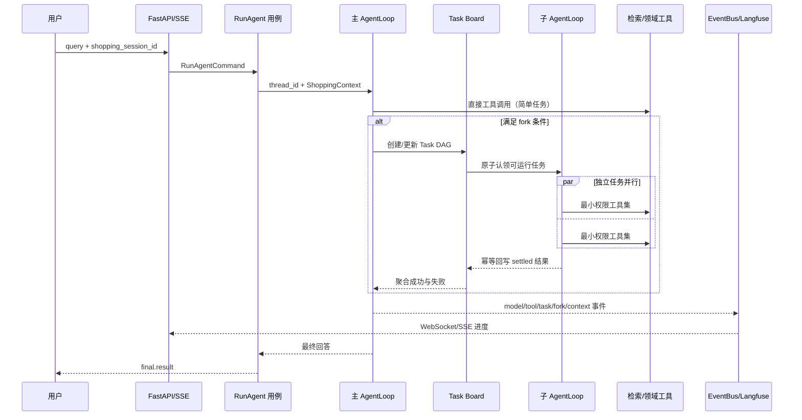

# Globex Agent 面试证据链

本目录是项目事实的唯一面试入口。任何简历数字都必须先有 Claim ID，再能定位到代码、测试与固定 Commit 上的脱敏报告。原始报告位于被 Git 忽略的 `eval/reports/evidence/`，只有 `publish` 生成的快照可以提交。

## 90 秒项目介绍

Globex Agent 是一个面向跨境购物决策的 Agent 平台。用户可以让主 Agent 直接检索商品、查询品类知识、记录偏好和创建订单意向；复杂请求会被拆成带依赖的 Task DAG，再派发到具有最小工具权限、独立 `thread_id` 的子 Agent。平台以 LangGraph/LangChain 实现运行图，以四层上下文、Cache Epoch 和 Breakpoint 管理长会话，以 OpenSearch Hybrid RRF + BGE 重排实现品类 RAG，以 BGE-M3 + FAISS + 交叉编码重排实现商品搜索。

工程上采用 DDD-lite + Hexagonal：商品、SKU、Money、关税和订单规则位于 Domain；用例、编排和端口位于 Application；LangGraph、OpenSearch、Redis、SQLite、Langfuse 和 FastAPI 位于 Infrastructure/Presentation。项目的交易边界是“订单意向”，不连接真实库存、支付、退款或第三方平台下单。

## 一次请求时序

## Claim—代码—测试—报告

| Claim ID | 能力 | 当前声明 | 代码锚点 | 测试锚点 | 正式报告 |
|---|---|---|---|---|---|
| ARCH-001 | DDD-lite/Hexagonal 依赖隔离 | `code_verified`，运行离线套件后可升级 | `app/domain`、`app/application`、`app/composition.py` | `tests/test_architecture.py` | `architecture.json` |
| ORCH-001 | Task DAG、并行派发、租约恢复、幂等回写、上下文隔离 | `code_verified` | `app/application/tasking`、`app/infrastructure/langchain/sub_agents` | `tests/test_tasking.py`、`tests/test_fork_sub_agents.py` | `orchestration.json` |
| CTX-001 | Cache-aware 会话上下文治理 | `code_verified`，真实 A/B/C 前不得写收益 | `app/infrastructure/context_governance` | `tests/test_context_governance.py` | `context.json` |
| RAG-001 | 品类知识 Hybrid RAG | 已有冻结集基线；拒答优化需新报告确认 | `app/infrastructure/retrieval/category_insight` | `tests/test_opensearch_category_insight.py` | `category_*.json` |
| SEARCH-001 | 商品召回与重排 | 已有 67 条冻结集结果 | `app/application/catalog/search_catalog.py` | `tests/test_item_search.py` | `product_*.json` |
| SEARCH-PERSONALIZATION-001 | User Tower 个性化 on/off | `code_verified`，待定向集正式报告 | `app/application/catalog/fusion.py` | `tests/test_preferences.py` | `product_personalization.json` |
| COMMERCE-001 | 个性化、到手价和订单意向规则 | `code_verified` | `app/domain`、`app/application/memory`、`app/application/orders` | `tests/test_preferences.py`、`tests/test_pricing.py`、`tests/test_orders.py` | `commerce-001.json` |
| REL-001 | 降级、重试、熔断、部分失败和应急投影 | `code_verified` | `app/infrastructure/langchain/reliability_middleware.py` | `tests/test_platform_extensions.py`、`tests/test_item_search.py` | `rel-001.json` |
| OBS-001 | 逐事件推送与 Langfuse Trace | 本地候选已回读完整主/子 Trace；正式状态待发布 | `app/application/events`、`app/infrastructure/observability`、`scripts/evidence/observability.py` | `tests/test_eventbus.py`、`tests/test_run_agent.py`、`tests/test_evidence_infrastructure.py` | `observability.json` |
| BOUNDARY-PAYMENT | 真实库存、支付、退款和平台下单 | `boundary` | `app/domain/order` | 不适用 | 不得升级 |

状态以最新正式报告为准，不能只凭此表升级简历措辞。

## 最新本地候选结果（尚未正式发布）

当前工作区仍包含本轮实现改动，因此以下报告虽然通过验收，但只属于原始候选，不能代替干净 Commit 上的正式快照：

- `20260908T160311Z-offline`：全部通过；170 项测试，总覆盖率 73.42%，关键领域规则分支覆盖率 100%，17 类故障注入全部通过。
- `20260908T143344Z-live`：全部通过；36 次真实 Kimi 运行通过率 97.22%，请求数与上下文压缩合计恰好 250 次，总观测 Token 679,584。
- `CTX-001`：`full` 相比 `off` 输入 Token 降低 32.21%，信息保留率 100%，同 Epoch 稳定前缀率 100%，触发 7 次摘要和 7 次大工具结果卸载。
- `ORCH-001`：30 轮 4 路 I/O 的 P50 加速 3.55×；重复派发率、上下文泄漏率为 0，中断恢复率与幂等回写率为 100%。
- `OBS-001`：从 Langfuse 抽样回读 3/3 条完整主/子 Agent Trace，run/trace 映射率 100%，并覆盖 Fork、压缩与 final 事件摘要；不据此推断全量遥测上传率。

正式取证拆分为 offline、live-e2e、live-context 三套独立报告；某一套失败时只重跑该部分。发布器会拒绝脏工作区、失败套件、Commit 不一致和脱敏扫描不通过的报告。

## 深挖材料

- [架构与权限](architecture.md)
- [多 Agent 与 Task DAG](multi_agent.md)
- [上下文治理](context_governance.md)
- [两套检索](retrieval.md)
- [个性化、计价与订单边界](commerce.md)
- [可靠性与可观测性](reliability.md)
- [复现实验手册](reproduction.md)
- [诚实边界](boundaries.md)
- [当前实现与取证状态](implementation_status.md)

## 当前可引用基线

- 商品冻结集 67 条：Recall@10 96.27%、MRR@10 93.22%、NDCG@10 92.58%。
- 品类冻结集 100 条：最新候选 Hybrid + Reranker 的 Recall@10 94.44%、MRR@10 80.37%、NDCG@10 81.79%、负例拒识率 90%；独立开发集选择阈值 0.01，未用冻结测试集调参。
- OpenSearch Hybrid + BGE Reranker 已通过工具级运行；自动化测试数必须引用最新 `tests.json`，不要手工维护。

以上数字已有真实原始报告，但工作区提交并重新发布前仍不是可提交的正式证据快照。
