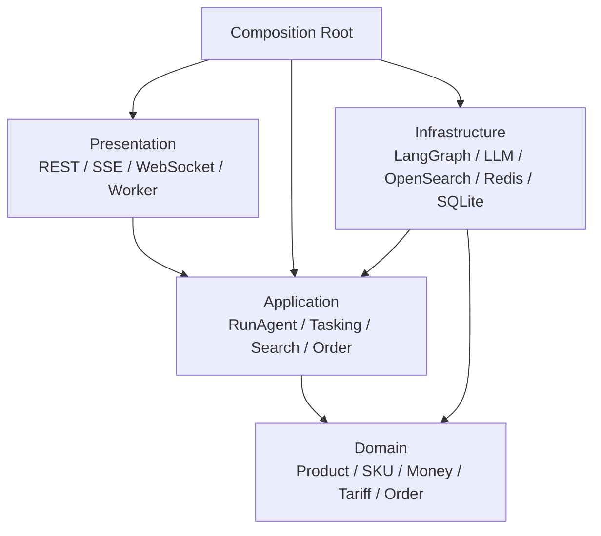

# ARCH-001：架构与权限

## 设计

依赖规则不是靠约定：AST 测试拒绝 Domain 导入 LangChain、LangGraph、FastAPI、OpenSearch、Redis 或 Application；Application 只能依赖 Domain 和端口，具体适配器由 `app/composition.py` 装配。

主 Agent 拥有任务、偏好和订单意向等写工具；子 Agent 只得到完成检索任务所需的只读工具。这样即使主/子复用同一份已编排 Agent 图定义，执行状态、会话目录和工具权限仍相互隔离。

## STAR 话术

- S：Agent 框架、检索实现和电商规则混在一起，规则难单测、基础设施难替换。
- T：保护平台核心规则，使 LangGraph、模型、Redis 或 OpenSearch 可替换。
- A：建立 Domain/Application/Infrastructure/Presentation 分层、端口与 Composition Root，并用 AST 回归测试阻止反向依赖。
- R：离线证据套件输出依赖边与零违规结果；覆盖率和固定 Commit 一起归档。未经报告不得声称生产收益。

## 常见追问

为什么不是“完整 DDD”？因为该项目规模尚不需要为每个子域建立独立聚合仓储与复杂事件一致性；采用 DDD-lite 是为了保护规则和边界，而不是堆叠名词。

LangGraph 为什么在 Infrastructure？Application 只需要“运行 Agent、派发任务、读取状态”的能力，LangGraph 是可替换的运行图实现，不应成为领域模型的一部分。
