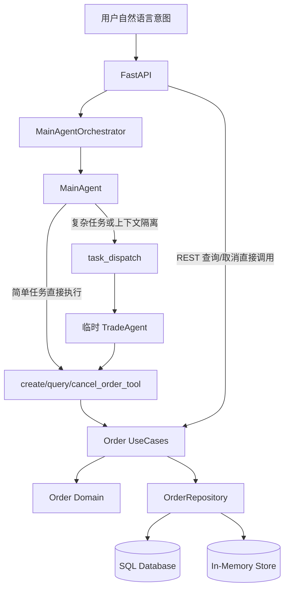
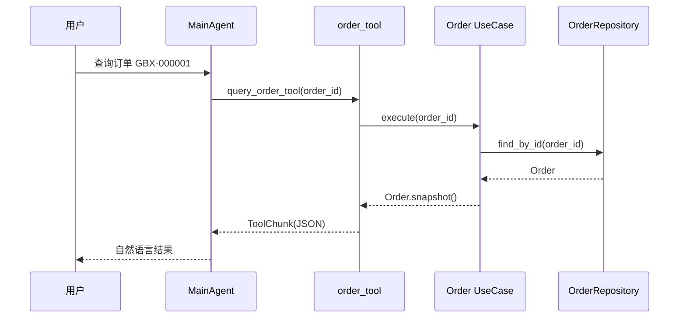
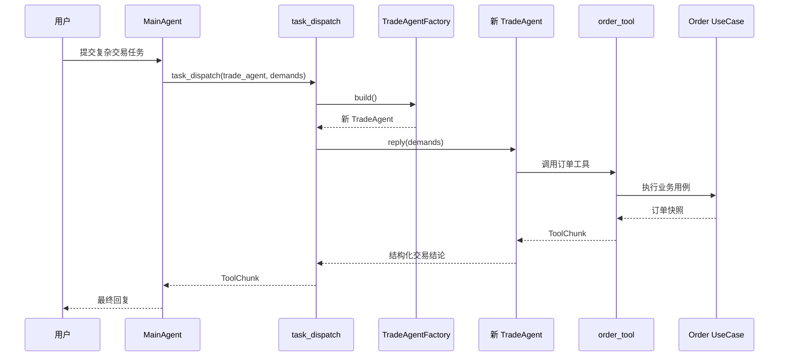
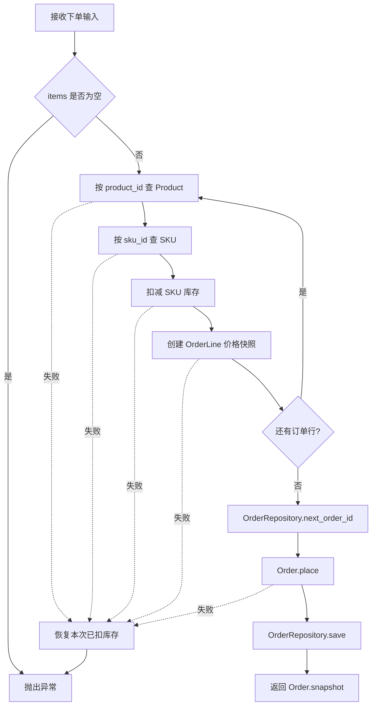
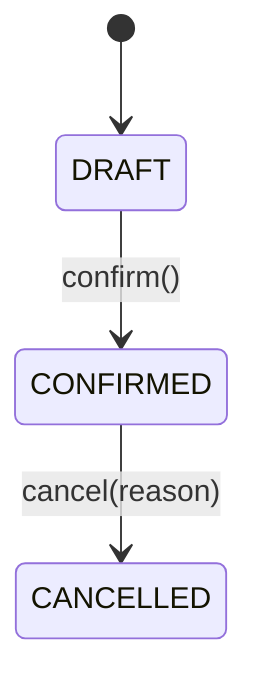

# Globex 订单工具与 TradeAgent 全流程参考

> 本文以当前仓库实现为准，描述订单从依赖装配、Agent 决策、工具调用、应用用例、领域模型、库存处理、持久化、REST 接口到前端事件展示的完整链路。  
> 按要求，本文只覆盖订单业务主链与常规运行支撑，不讨论运行时断言、循环检测等旁路机制。  
> 订单模块属于教学/MVP 实现，不应直接视为生产级交易系统。

## 1. 总体结论

Globex 中的订单能力由三个工具提供：

```text
create_order_tool   创建订单
query_order_tool    查询订单
cancel_order_tool   取消订单
```

这些工具不只属于 TradeAgent。系统存在三条订单执行路径：

```text
路径 A：MainAgent 直接调用订单工具
路径 B：MainAgent 通过 task_dispatch 派发 TradeAgent，再由 TradeAgent 调用订单工具
路径 C：REST 查询/取消接口绕过 Agent 和工具，直接调用订单 UseCase
```

三条路径最终收敛到同一套应用用例、订单领域模型和 `OrderRepository`。



## 2. 关键文件

| 层次 | 文件 | 职责 |
|---|---|---|
| 装配 | `app/composition.py` | 创建仓储、UseCase、TradeAgentFactory，并注入 MainAgent |
| 主 Agent | `app/application/agents/main_agent.py` | 直接持有订单工具，也可以派发 TradeAgent |
| 子 Agent | `app/application/agents/trade_agent.py` | 定义 TradeAgentFactory 和 TradeAgent 工具集 |
| 子 Agent 调度 | `app/application/tools/task_dispatch_tool.py` | 按需调用 `trade_factory.build()` 创建临时 TradeAgent |
| 提示词 | `app/application/prompts/globex.yml` | 定义 MainAgent 和 TradeAgent 的订单行为约束 |
| 权限 | `app/application/agents/permissions.py` | 精确放行已知订单写工具 |
| 工具 | `app/application/tools/order_tools.py` | 定义创建、查询、取消三个 Agent 工具 |
| UseCase | `app/application/usecases/order_usecases.py` | 编排商品、库存、订单聚合和仓储 |
| 订单聚合 | `app/domain/order/order.py` | 订单状态机、总金额、快照 |
| 订单行 | `app/domain/order/order_line.py` | SKU 单价快照、数量、小计 |
| 地址 | `app/domain/order/address.py` | 收货地址值对象 |
| 仓储端口 | `app/domain/order/ports/order_repository.py` | 订单持久化抽象 |
| 商品聚合 | `app/domain/catalog/product.py` | 按 product_id 还原商品并查找 SKU |
| SKU | `app/domain/catalog/sku.py` | 库存扣减与恢复 |
| 金额 | `app/domain/catalog/money.py` | 最小货币单位、乘法和加法 |
| 商品仓储端口 | `app/domain/catalog/ports/product_repository.py` | 根据 product_id 查询商品 |
| 种子商品 | `app/infrastructure/persistence/seed_products.py` | 当前商品、SKU、价格和初始库存来源 |
| SQL 表 | `app/infrastructure/persistence/sql/tables.py` | `orders` 和 `order_items` 表定义 |
| SQL 仓储 | `app/infrastructure/persistence/sql/repositories.py` | `SqlOrderRepository` |
| 内存仓储 | `app/infrastructure/persistence/in_memory_repositories.py` | `InMemoryOrderRepository` 和商品内存仓储 |
| 请求上下文 | `app/infrastructure/context.py` | 提供可信的 buyer_id 和 session_id |
| 事件 | `app/infrastructure/eventbus.py` | 发布订单工具调用及结果事件 |
| 韧性 | `app/infrastructure/resilience.py` | 订单工具超时、异常包装和熔断 |
| 输出审核 | `app/infrastructure/security/output_guard.py` | 从最终回复中脱敏内部工具名称 |
| Orchestrator | `app/application/agents/orchestrator.py` | 管理一轮 Agent 执行、上下文、事件和持久化 |
| REST 服务 | `app/presentation/server.py` | 查询和取消订单的直连 HTTP 接口 |
| REST DTO | `app/presentation/dto.py` | 定义取消订单请求 |
| Worker | `app/worker.py` | 队列开启时在 worker 进程执行自然语言订单意图 |
| 前端事件 | `frontend/src/components/EventTimeline.tsx` | 展示订单号和订单状态 |
| 前端入口 | `frontend/src/App.tsx` | 订阅 WebSocket 订单过程事件和最终回复 |

## 3. Composition Root：订单依赖如何创建

所有订单依赖在 `app/composition.py` 中统一装配。

### 3.1 选择 OrderRepository

正常数据库模式下使用：

```python
order_repo = SqlOrderRepository(db_engine)
```

当：

```text
DATABASE_URL=file
```

时使用：

```python
order_repo = InMemoryOrderRepository()
```

这里有一个容易误解的边界：`DATABASE_URL=file` 时，偏好、会话状态和对话流水会写 JSON，但订单不会写 JSON，而是只保存在进程内存。

### 3.2 创建三个 UseCase

```python
place_order = PlaceOrderUseCase(product_repo, order_repo)
query_order = QueryOrderUseCase(order_repo)
cancel_order = CancelOrderUseCase(product_repo, order_repo)
```

依赖关系如下：

```text
PlaceOrderUseCase
  ├── ProductRepository：查商品、查 SKU、扣库存
  └── OrderRepository：生成订单号、保存订单

QueryOrderUseCase
  └── OrderRepository：查询订单

CancelOrderUseCase
  ├── OrderRepository：查询并保存取消后的订单
  └── ProductRepository：查 SKU、恢复库存
```

### 3.3 创建 TradeAgentFactory

```python
trade_factory = TradeAgentFactory(
    settings,
    place_order,
    query_order,
    cancel_order,
    bus,
    circuit_registry,
    throttle,
)
```

随后将它注入 MainAgentFactory：

```python
main_factory = MainAgentFactory(
    settings,
    search_factory,
    trade_factory,
    bus,
    preference_store,
    circuit_registry,
    throttle,
    ...,
)
```

同时，`query_order` 和 `cancel_order` 被放入 Container，供 REST 接口直接调用。

## 4. TradeAgentFactory 的职责

`TradeAgentFactory` 定义在 `app/application/agents/trade_agent.py`。

它保存：

```text
Settings
PlaceOrderUseCase
QueryOrderUseCase
CancelOrderUseCase
TradeEventBus
CircuitBreakerRegistry
GatewayThrottle
```

它不保存：

- 当前买家；
- 当前订单；
- TradeAgent 对话上下文；
- 某次派发任务的 demands；
- AgentState。

### 4.1 `build_tools()`

`build_tools()` 创建三个 AgentScope `FunctionTool`：

```python
FunctionTool(build_create_order_tool(...))
FunctionTool(build_query_order_tool(...), is_read_only=True)
FunctionTool(build_cancel_order_tool(...))
```

其中只有查询工具被声明为只读：

```text
create_order_tool：写操作
query_order_tool：只读操作
cancel_order_tool：写操作
```

每次调用 `build_tools()` 都会创建新的工具闭包和 FunctionTool 包装对象，但底层 UseCase、事件总线和熔断注册表仍是共享对象。

### 4.2 `build()`

`build()` 创建一个全新的 TradeAgent：

```python
Agent(
    name=...,
    system_prompt=...,
    model=create_chat_model(...),
    toolkit=Toolkit(tools=self.build_tools()),
    middlewares=...,
    context_config=...,
    react_config=ReActConfig(max_iters=6),
)
```

每次创建出来的 TradeAgent 拥有独立的：

- Agent 实例；
- AgentState；
- 对话上下文；
- Toolkit；
- ReAct 执行过程。

但共享：

- 订单 UseCase；
- OrderRepository；
- ProductRepository；
- EventBus；
- GatewayThrottle；
- 熔断状态。

TradeAgent 是任务级临时对象，不像 MainAgent 那样按购物会话长期缓存和恢复。

## 5. MainAgent 如何使用订单能力

MainAgent 对 TradeAgentFactory 有两种用法。

### 5.1 简单任务：MainAgent 直接调用订单工具

MainAgent 创建 Toolkit 时直接加入：

```python
*self._trade_factory.build_tools()
```

因此一次简单查单、取消或已经确认后的下单，可以由 MainAgent 直接调用订单工具：



这条路径不会创建 TradeAgent。

### 5.2 复杂任务：派发 TradeAgent

MainAgent 还拥有 `task_dispatch`：

```python
task_dispatch(
    subagent_type="trade_agent",
    demands="...",
)
```

`task_dispatch_tool.py` 会调用：

```python
worker = trade_factory.build()
reply = await worker.reply(inputs)
```

调用链：



子 Agent 看不到 MainAgent 的完整历史，所以 `demands` 必须包含完成任务所需的订单号、商品 ID、SKU、数量、地址和确认状态等上下文。

## 6. 订单提示词约束

订单行为规则位于 `app/application/prompts/globex.yml`。

### 6.1 MainAgent 规则

MainAgent 被要求：

- 创建或取消订单前先输出确认卡；
- 确认卡应包含商品、数量、金额和地址；
- 得到用户明确确认后才执行写操作；
- 价格、库存和金额只能来自工具；
- 不承诺支付、退款路径、发货时效和物流能力；
- 简单订单任务优先直接调用工具，不滥用 TradeAgent。

### 6.2 TradeAgent 规则

TradeAgent 被要求：

- 取消前先查询订单状态；
- 创建订单时原样透传 `product_id/sku_id`；
- 不替换商品；
- 不自行计算金额；
- 将工具错误原样交回 MainAgent；
- 最终输出订单操作的结构化 JSON；
- 不涉及支付和物流。

确认卡是对话行为约束，不是数据库中的审批状态。系统没有单独保存“用户已批准本次写操作”的审批记录。

## 7. 订单工具权限

AgentScope 默认会对非只读工具要求用户确认。本项目通过 `app/application/agents/permissions.py` 为已知业务工具追加精确放行规则：

```text
create_order_tool
cancel_order_tool
task_dispatch
```

`query_order_tool` 已声明为只读，不需要写工具放行规则。

这里没有全局关闭权限引擎，而是只放行已知业务工具。这样未来如果加入文件、Shell 或其他危险工具，它们仍会受到默认权限规则约束。

## 8. ShoppingContext：buyer_id 的可信来源

自然语言模型不负责提供订单所属买家。

一轮意图开始时，orchestrator 设置：

```text
shopping_session_id
buyer_id
locale
currency
```

到 `ShoppingContext` 中。

`create_order_tool` 执行时读取：

```python
snapshot_ctx = ShoppingContext.current()
buyer_id = snapshot_ctx.buyer_id if snapshot_ctx else "anonymous"
```

工具签名中没有 `buyer_id` 参数，因此模型无法通过工具参数把订单写到另一个买家名下。

这只是应用内的身份传递机制，不等于 HTTP 层已经完成认证。当前 `buyer_id` 最初仍来自客户端请求。

## 9. create_order_tool

定义位置：`app/application/tools/order_tools.py`。

### 9.1 输入

```json
{
  "items": [
    {
      "product_id": "P1001",
      "sku_id": "P1001-S1",
      "quantity": 1
    }
  ],
  "shipping_address": {
    "recipient_name": "张三",
    "country": "CN",
    "state": "上海",
    "city": "上海",
    "address_line": "示例路 1 号",
    "postal_code": "200000",
    "phone": "13800000000"
  }
}
```

### 9.2 执行步骤

```text
读取 ShoppingContext 中的 buyer_id/session_id
→ 发布 tool.invoke
→ 把 items 转为 OrderItemInput
→ 把 shipping_address 转为 Address
→ 调用 PlaceOrderUseCase.execute()
→ 成功：发布 tool.result(order snapshot)
→ 失败：返回 [error] ToolChunk
```

数量会执行：

```python
int(item.get("quantity", 1))
```

缺少 `product_id` 或 `sku_id` 会触发 `KeyError`，非法数量、地址、商品、SKU 或库存会触发 `ValueError`，这些错误都会被工具转换为错误 ToolChunk。

## 10. PlaceOrderUseCase：创建订单业务流程

`PlaceOrderUseCase.execute()` 接收：

```text
buyer_id
items: list[OrderItemInput]
shipping_address: Address
```

执行流程：



### 10.1 商品和 SKU 校验

每个订单行依次执行：

```python
product = await product_repo.find_by_id(product_id)
sku = product.find_sku(sku_id)
```

错误情况：

```text
商品不存在：商品 ID 不在内存商品目录
SKU 不存在：SKU 不属于该商品
库存不足：sku.stock < quantity
```

### 10.2 库存扣减和局部回滚

SKU 使用：

```python
sku.deduct_stock(quantity)
```

UseCase 记录已经成功扣减的 `(sku, quantity)`。如果后续任一步失败，会执行：

```python
sku.restore_stock(quantity)
```

该回滚只覆盖 UseCase 内存执行阶段的异常。订单保存成功后库存仍只存在进程内，不属于同一个数据库事务。

### 10.3 订单行价格快照

创建 `OrderLine` 时把当前 SKU 价格写入：

```python
unit_price=sku.price
```

订单之后再查询时使用订单行内的单价快照，不重新读取商品当前价格，因此商品调价不会改变历史订单金额。

### 10.4 订单号与状态

UseCase 先调用：

```python
await order_repo.next_order_id()
```

然后执行：

```python
Order.place(...)
```

`Order.place()` 会立即调用 `confirm()`，所以新订单直接进入：

```text
CONFIRMED
```

系统没有真实支付授权、支付中或已支付状态。

## 11. query_order_tool 与 QueryOrderUseCase

### 11.1 工具输入

```json
{
  "order_id": "GBX-000001"
}
```

### 11.2 调用链

```text
query_order_tool
→ 发布 tool.invoke
→ QueryOrderUseCase.execute(order_id)
→ OrderRepository.find_by_id(order_id)
→ Order.snapshot()
→ 发布 tool.result
→ 返回 JSON ToolChunk
```

订单不存在时返回：

```text
[error] 订单不存在：GBX-xxxxxx
```

## 12. cancel_order_tool 与 CancelOrderUseCase

### 12.1 工具输入

```json
{
  "order_id": "GBX-000001",
  "reason": "不再需要"
}
```

### 12.2 调用链

```text
cancel_order_tool
→ 发布 tool.invoke
→ CancelOrderUseCase.execute(order_id, reason)
→ 查询 Order
→ Order.cancel(reason)
→ 遍历订单行并恢复进程内 SKU 库存
→ 保存订单
→ 发布 tool.result
→ 返回 JSON ToolChunk
```

### 12.3 取消规则

`Order.cancel()` 强制要求：

```text
当前状态必须是 CONFIRMED
reason 必须是非空字符串
```

已经取消的订单不能再次取消。

### 12.4 库存恢复

取消后，UseCase 按订单行执行：

```python
product = await product_repo.find_by_id(line.product_id)
sku = product.find_sku(line.sku_id)
sku.restore_stock(line.quantity)
```

如果商品或 SKU 已经不在当前进程的商品目录中，该行库存恢复会被跳过，而不会阻止订单状态保存为 `CANCELLED`。

## 13. Order 领域模型

订单聚合位于 `app/domain/order/order.py`。

### 13.1 状态机



当前没有以下状态：

```text
PENDING_PAYMENT
PAID
SHIPPED
DELIVERED
REFUNDED
```

### 13.2 聚合不变量

Order 构造时保证：

- `order_id` 非空；
- `buyer_id` 非空；
- 至少有一条订单行；
- 所有订单行币种一致。

`confirm()` 保证只有 `DRAFT` 可以确认。

`cancel()` 保证只有 `CONFIRMED` 可以取消，并要求取消原因。

### 13.3 总金额

每条订单行计算：

```text
line subtotal = unit_price × quantity
```

订单总金额：

```text
total_amount = 所有订单行 subtotal 相加
```

`Money` 要求币种一致，所以混合币种订单会在 Order 构造阶段被拒绝。

订单总金额目前只包括商品行金额，不包括：

- `landed_price`；
- 运费；
- 关税；
- 清关费；
- 支付手续费；
- 优惠或税费调整。

检索阶段返回的到手价没有进入订单结算。

### 13.4 订单快照

`Order.snapshot()` 返回：

```json
{
  "order_id": "GBX-000001",
  "buyer_id": "buyer-001",
  "status": "CONFIRMED",
  "total_amount_major": 189.0,
  "currency": "CNY",
  "shipping_address": "CN 上海 上海 示例路 1 号（张三 13800000000）",
  "lines": [
    {
      "product_id": "P1001",
      "sku_id": "P1001-S1",
      "title": "商品标题（规格）",
      "unit_price_major": 189.0,
      "quantity": 1
    }
  ],
  "created_at": "...",
  "cancel_reason": null
}
```

该快照是订单工具和 REST 接口的主要输出契约。

## 14. Address 值对象

Address 包含：

```text
recipient_name
country
state
city
address_line
postal_code
phone
```

强制非空字段：

```text
recipient_name
country
city
address_line
```

以下字段当前允许为空：

```text
state
postal_code
phone
```

`country` 在订单模块中只用于存储和展示。创建订单时不会根据地址重新计算运费、关税或验证商品是否可以配送到该国家。

## 15. OrderLine 与 Money

### 15.1 OrderLine

订单行保存：

```text
product_id
sku_id
title
unit_price
quantity
```

`quantity` 必须大于 0。

### 15.2 Money

金额使用最小货币单位整数，例如：

```text
189.00 CNY → 18900
```

金额加法要求币种一致，订单行金额通过整数乘法计算，避免直接累计浮点价格。

当前 `Money` 简化为所有支持币种都按 100 个最小单位换算，包括 JPY；这属于演示实现。

## 16. SQL 持久化

### 16.1 表结构

订单主表：

```text
orders
```

主要字段：

```text
order_id
buyer_id
status
currency
total_amount_minor
shipping_address_json
created_at
confirmed_at
cancelled_at
cancel_reason
```

订单行表：

```text
order_items
```

主要字段：

```text
order_id
product_id
sku_id
title
unit_price_minor
currency
quantity
```

### 16.2 SqlOrderRepository.save()

保存流程：

```text
计算订单总金额
→ merge 订单主表
→ 删除该订单旧订单行
→ 重新插入全部订单行
→ commit
```

订单行采用整体重写，而不是逐行 diff。

### 16.3 SqlOrderRepository.find_by_id()

查询流程：

```text
查询 OrderRow
→ 查询对应 OrderLineRow
→ 还原 Address
→ 还原 Money
→ 还原 OrderLine
→ 还原 Order 聚合
```

### 16.4 订单号生成

SQL 实现使用：

```text
当前订单总数 + 1
```

格式为：

```text
GBX-000001
```

这不是高并发安全的数据库序列。两个并发创建操作可能得到相同订单号。

## 17. 内存持久化和库存边界

### 17.1 InMemoryOrderRepository

内存实现使用：

```python
dict[str, Order]
```

订单号使用进程内 `itertools.count()` 自增。

进程退出后订单丢失。

### 17.2 商品和库存始终是内存态

无论订单使用 SQL 还是内存仓储，当前商品和 SKU 库存都来自：

```text
seed_products.py
→ InMemoryProductRepository
```

因此：

- SKU 库存不会保存到 SQL；
- 进程重启后恢复种子库存；
- API 与 worker 有各自独立的库存副本；
- 多个 worker 之间也有独立库存副本；
- SQL 订单持久化成功不意味着全局库存已经一致扣减；
- API 进程直接取消订单时，恢复的是 API 自己的库存副本，不一定是创建订单的 worker 副本。

这是当前订单流程最重要的生产边界。

## 18. 工具事件

三个订单工具都会发布：

```text
tool.invoke
tool.result
```

创建订单开始事件示例：

```json
{
  "type": "tool.invoke",
  "payload": {
    "tool": "create_order_tool",
    "args": {
      "buyer_id": "buyer-001",
      "items": []
    }
  }
}
```

成功结果示例：

```json
{
  "type": "tool.result",
  "payload": {
    "tool": "create_order_tool",
    "order": {
      "order_id": "GBX-000001",
      "status": "CONFIRMED"
    }
  }
}
```

失败结果包含：

```json
{
  "tool": "create_order_tool",
  "error": "错误原因"
}
```

如果 TradeAgent 由 `task_dispatch` 创建，还会额外产生：

```text
agent.dispatch
tool.result（task_dispatch 完成时间和耗时）
```

## 19. 工具韧性

三个订单工具都挂载 `ToolResilienceMiddleware`。

默认超时：

```text
create_order_tool：10 秒
query_order_tool：10 秒
cancel_order_tool：10 秒
```

中间件负责：

- 工具调用超时；
- 未捕获异常转错误 ToolChunk；
- 工具返回 ERROR 时累计失败；
- 连续失败达到阈值后熔断；
- 冷却后半开探测；
- 通过 EventBus 发布熔断和错误信息。

熔断状态默认在进程内共享；配置共享熔断并且 Redis 可用时，可以跨实例共享。

## 20. Orchestrator 在订单流程中的作用

自然语言订单意图首先进入 `MainAgentOrchestrator.handle_intent()`。

它负责：

```text
设置 ShoppingContext
→ 获取或恢复 MainAgent
→ 注入本轮用户消息
→ 消费 MainAgent 流式输出
→ 接收 MainAgent 直接调用或 TradeAgent 派发产生的工具事件
→ 输出审核
→ 发布 final.result
→ 保存 MainAgent AgentState
→ 保存买家和 Agent 最终对话流水
```

如果 Agent 或工具链异常，orchestrator 通常返回：

```text
[error] 错误原因
```

因此自然语言意图接口可能返回 HTTP 200，但 `final_text` 是业务错误文本。

## 21. 队列与 worker 路径

Redis 队列关闭时：

```text
FastAPI
→ MainAgentOrchestrator
→ MainAgent/TradeAgent
→ order tool
```

Redis 队列开启时：

```text
FastAPI
→ Redis Stream IntentTask
→ worker
→ MainAgentOrchestrator
→ MainAgent/TradeAgent
→ order tool
```

队列意图采用 at-least-once 语义。API 使用“会话 ID + 原始问句”指纹做短期入队去重，但订单创建 UseCase 本身没有业务幂等键。

如果 worker 在订单保存成功后、队列 ack 前崩溃，同一个意图被重新处理时仍有重复创建订单的风险。

## 22. REST 查询和取消路径

FastAPI 提供两个直接订单接口。

### 22.1 查询订单

```http
GET /commerce/orders/{order_id}
```

调用链：

```text
server.py
→ container.query_order.execute(order_id)
→ OrderRepository.find_by_id()
→ Order.snapshot()
```

订单不存在返回 HTTP 404。

### 22.2 取消订单

```http
POST /commerce/orders/{order_id}/cancel
Content-Type: application/json

{
  "reason": "不再需要"
}
```

调用链：

```text
server.py
→ container.cancel_order.execute(order_id, reason)
→ Order.cancel(reason)
→ 恢复进程内库存
→ OrderRepository.save()
```

业务错误返回 HTTP 400。

### 22.3 直连接口的边界

这两个 REST 接口不会经过：

- MainAgent；
- TradeAgent；
- 订单工具；
- Agent 提示词中的确认卡流程。

当前 REST 接口也没有认证和订单所有权校验。仅知道 `order_id` 就可以查询或请求取消订单，不适合作为生产安全边界。

项目当前没有直接创建订单的 REST 接口。

## 23. 前端表现

当前前端没有专门的：

- 订单详情页面；
- 订单列表；
- 确认卡组件；
- 取消订单按钮；
- TypeScript Order 类型。

前端通过 `App.tsx` 建立 WebSocket，接收订单过程事件和最终回复。

`EventTimeline.tsx` 对包含 `payload.order` 的工具结果显示：

```text
工具名 → 订单号 订单状态
```

用户最终看到的完整订单说明主要由 MainAgent 的 `final.result` 文本提供。

## 24. 输出审核

最终回复交给用户前，orchestrator 会调用输出审核逻辑。

内部实现名称：

```text
create_order_tool
query_order_tool
cancel_order_tool
```

会被视为内部工具名并从最终面向用户的回复中脱敏。订单号、商品 ID 和用户可见订单事实不会因为是业务标识而自动隐藏。

## 25. 相关测试

### 25.1 `tests/test_domain.py`

验证：

- Money 运算；
- Order 状态机；
- 创建、确认和取消；
- 非法状态迁移；
- 取消原因规则。

### 25.2 `tests/test_usecases.py`

验证：

- 创建订单；
- 查询订单；
- 取消订单；
- 库存扣减；
- 取消后的库存恢复；
- 商品、SKU 和订单不存在等错误。

### 25.3 `tests/test_tools_and_eventbus.py`

验证：

- `create_order_tool` 成功路径；
- 工具错误路径；
- `tool.invoke/tool.result` 事件。

### 25.4 `tests/test_phase4_sql.py`

验证：

- SQL 订单保存；
- 订单行保存和聚合还原；
- 取消状态持久化；
- 不存在订单；
- 订单号生成。

### 25.5 `tests/test_subagent_preference_inject.py`

验证长期偏好不会注入 TradeAgent。TradeAgent 只应执行已确定的订单参数，不应根据推荐偏好自行替换商品。

## 26. 三条完整调用链

### 26.1 MainAgent 直接创建订单

```text
POST /commerce/intents
→ MainAgentOrchestrator.handle_intent()
→ SessionRegistry 获取 MainAgent
→ MainAgent 判断用户已经确认
→ create_order_tool
→ 从 ShoppingContext 读取 buyer_id
→ PlaceOrderUseCase
→ ProductRepository 查询商品
→ Product.find_sku()
→ Sku.deduct_stock()
→ 创建 OrderLine 价格快照
→ OrderRepository.next_order_id()
→ Order.place()
→ Order.confirm()
→ OrderRepository.save()
→ Order.snapshot()
→ tool.result
→ MainAgent 最终回复
→ final.result
```

### 26.2 派发 TradeAgent 创建订单

```text
POST /commerce/intents
→ MainAgentOrchestrator
→ MainAgent
→ task_dispatch(subagent_type="trade_agent", demands=...)
→ TradeAgentFactory.build()
→ 新 TradeAgent
→ create_order_tool
→ PlaceOrderUseCase
→ Product/SKU/库存
→ Order 聚合
→ OrderRepository
→ TradeAgent 结构化结论
→ task_dispatch 返回 MainAgent
→ MainAgent 最终回复
```

### 26.3 REST 直接取消订单

```text
POST /commerce/orders/{order_id}/cancel
→ CancelOrderRequest.reason
→ CancelOrderUseCase
→ OrderRepository.find_by_id()
→ Order.cancel(reason)
→ ProductRepository.find_by_id()
→ Sku.restore_stock()
→ OrderRepository.save()
→ HTTP JSON 响应
```

## 27. 当前实现的重要边界

1. **没有支付和物流。** 创建订单只生成 `CONFIRMED` 意向单据。
2. **订单金额不含运费和关税。** 检索阶段的 `landed_price` 没有进入订单行或订单总额。
3. **库存不持久化。** SQL 只保存订单，不保存 Product/SKU 库存。
4. **库存不跨进程共享。** API 与各个 worker 拥有独立库存副本。
5. **订单创建没有业务幂等键。** 队列重投仍可能重复下单。
6. **SQL 订单号生成存在并发冲突风险。** 当前使用订单总数加一。
7. **确认主要依赖提示词。** 没有持久化审批状态证明用户已经确认写操作。
8. **REST 接口没有认证和所有权校验。** 不能视为生产安全接口。
9. **地址不驱动配送校验和计价。** 创建订单不会根据 `country` 重新校验配送或计算到手价。
10. **取消和库存恢复不在统一数据库事务中。** Order 保存和内存库存变更无法原子提交。
11. **TradeAgent 是临时 Agent。** 每次派发新建，执行完成后不保留自己的 AgentState。
12. **MainAgent 也能直接调用订单工具。** 不能假定所有订单都经过 TradeAgent。

## 28. 推荐阅读顺序

如果需要理解或修改订单流程，建议按以下顺序阅读：

```text
1. app/composition.py
2. app/application/agents/main_agent.py
3. app/application/tools/task_dispatch_tool.py
4. app/application/agents/trade_agent.py
5. app/application/prompts/globex.yml
6. app/application/tools/order_tools.py
7. app/application/usecases/order_usecases.py
8. app/domain/order/order.py
9. app/domain/order/order_line.py
10. app/domain/order/address.py
11. app/domain/catalog/product.py
12. app/domain/catalog/sku.py
13. app/domain/order/ports/order_repository.py
14. app/infrastructure/persistence/sql/repositories.py
15. app/infrastructure/persistence/sql/tables.py
16. app/presentation/server.py
17. tests/test_domain.py
18. tests/test_usecases.py
19. tests/test_tools_and_eventbus.py
20. tests/test_phase4_sql.py
```

## 29. 最终心智模型

```text
Agent 负责：
  理解自然语言、判断动作、组织工具参数、解释结果

订单工具负责：
  参数转换、身份上下文读取、事件发布、错误转 ToolChunk

UseCase 负责：
  编排商品、SKU、库存、订单聚合和仓储

Domain 负责：
  状态机、金额、数量、地址和业务不变量

Repository 负责：
  订单保存、查询和订单号生成
```

最准确的一句话描述：

> Globex 的订单链路是一套由 MainAgent 和临时 TradeAgent 共同复用的订单工具体系；工具向下调用统一的 UseCase 和 Order 聚合，订单默认持久化到 SQL，但商品库存仍是进程内状态，且当前交易不包含支付、物流、运费和关税结算。
